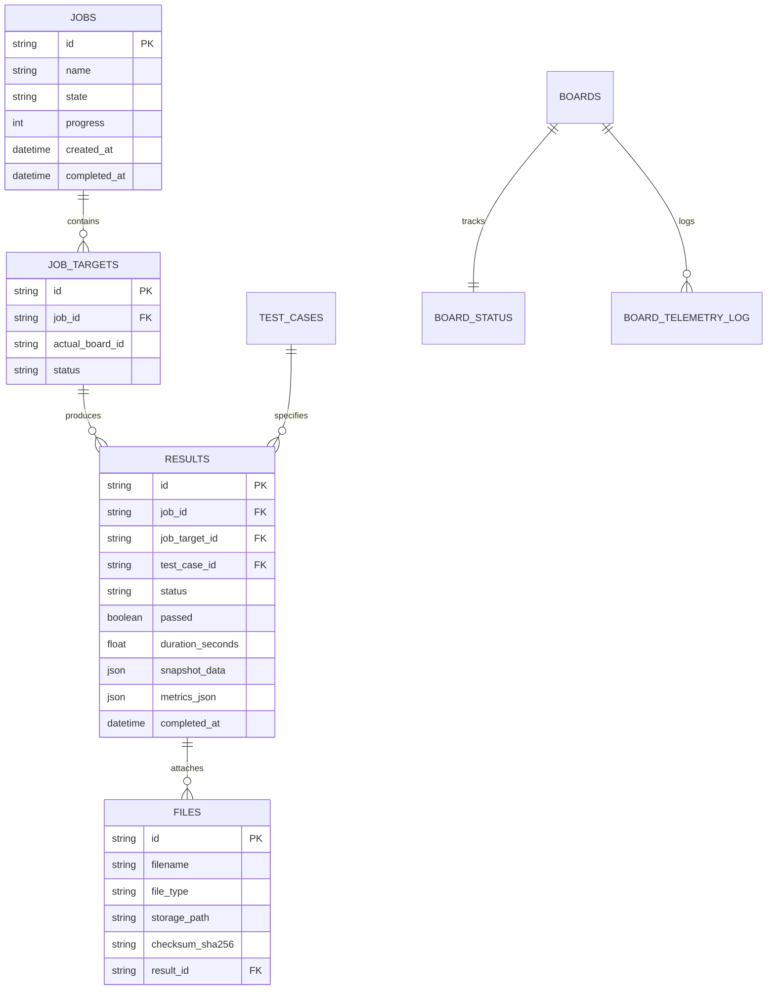

# 📋 Production Handoff Documentation
## Central Semiconductor Test Platform & FPGA Fleet Management (V2)

---

### 1. 🌐 System Overview & Architecture

The **Automate-Eval-System-V2-P3** is an enterprise-grade semiconductor evaluation and automated test platform. It coordinates hardware test runs, captures multi-channel high-speed digital/analog waveforms via **Xilinx Kria KR260 FPGA PL DMA**, and visualizes them on a high-performance web interface.

```mermaid
flowchart TB
    subgraph Frontend["Frontend (React 18 + Vite)"]
        UI_Home["Dashboard & Fleet Overview"]
        UI_Library["File Library (.ist, .erom, .ulp, .bin, .txt)"]
        UI_RunSet["Run Set & Batch Dispatcher"]
        UI_Waveform["Waveform Viewer (60fps Canvas + Quick Finder)"]
    end

    subgraph CentralServer["Central Platform (Docker: eval-system-dev @ Host Port 8000)"]
        API_Gateway["FastAPI Gateway & REST Routes"]
        Job_Queue["Job Queue Engine & Allocator"]
        Result_Store["Result Store & Normalizer"]
        Waveform_Proc["Waveform Ingestion (LZ4 -> HDF5 / VCD / CSV)"]
        DB[(PostgreSQL Database)]
        Storage[(NVMe Storage: uploads/)]
    end

    subgraph HardwareFleet["FPGA Hardware Fleet (KR260 @ 192.168.1.111)"]
        Agent_Daemon["Board Agent (systemd: board-agent.service)"]
        AXI_DMA["AXI DMA S2MM Engine (0xA0000000)"]
        DDR_RAM["High-Speed DDR4 RAM Buffer (0x800000000)"]
        FPGA_PL["FPGA PL Core & Hex Loader (0xA0020000)"]
    end

    Frontend <-->|REST API & WebSockets| API_Gateway
    API_Gateway --> Job_Queue
    Job_Queue --> DB
    Job_Queue -->|POST /execute| Agent_Daemon
    Agent_Daemon -->|POST /api/agent/heartbeat| API_Gateway
    Agent_Daemon -->|DMA Stream| DDR_RAM
    DDR_RAM -->|RAM-to-LZ4| Agent_Daemon
    Agent_Daemon -->|POST /v1/upload (Chunked)| Waveform_Proc
    Waveform_Proc --> Storage
    Waveform_Proc --> Result_Store
    Result_Store --> DB
```

---

### 2. 🔌 Network & Hardware Configuration Matrix

| Component | IP Address / Host | Port / Protocol | Credentials / Details |
| :--- | :--- | :--- | :--- |
| **Central Platform (Host)** | `192.168.1.103` (`localhost`) | `8000` (HTTP / WS) | Central Docker container `eval-system-dev` |
| **KR260 FPGA Board** | `192.168.1.111` | `22` (SSH), `8000` (Agent API) | User: `petalinux` / Pass: `Sic1219!` |
| **KR260 Board ID** | `kr260-28d429` | MAC: `00:0A:35:28:D4:29` | Model: `kr260` (PetaLinux 2025.1) |
| **PostgreSQL DB** | `postgres` (internal Docker) | `5432` | DB: `eval_db`, User: `postgres` |

#### Hardware Memory-Mapped Registers (KR260 PL):
* **AXI DMA S2MM Base**: `0xA0000000` (Control / Status registers)
* **BD Ring Base (Physical)**: `0x7F000000` (Buffer Descriptors)
* **Data Buffer Base (Physical)**: `0x800000000` (Direct DDR RAM buffer)
* **FPGA Hex Loader / Trigger Base**: `0xA0020000`
* **Dynamic Captured Length Register**: `0xA0020028`

---

### 3. 🛠️ Key Implemented Modules & Features

#### 📁 A. File Library & Whitelist Customization
* **Allowed File Whitelist**: Strictly restricted to `['ist', 'erom', 'ulp', 'bin', 'txt']`. Obsolete `.vcd`, `.hex`, `.elf`, `.lin`, `.sh` extensions have been removed from the UI import dialog.
* **Standalone Stimulus Support**: Single `.ist` files can be uploaded and dispatched as independent test cases without requiring `.erom` or `.ulp` firmware binaries.

#### 🎛️ B. Board Fleet Manager & Live Telemetry
* **Real-time Monitoring**: Heartbeat every 5s capturing CPU Temperature (°C), CPU Load (%), RAM Usage (MB), and FPGA PL status.
* **Management Controls**: Real-time board rename, delete confirmation modal, and heartbeat-aware online/offline tracking.

#### ⚡ C. End-to-End Automated Hardware Execution Pipeline
1. **Dispatch**: User clicks *Run* $\rightarrow$ Backend assigns `JobORM` and `ResultORM` records $\rightarrow$ Dispatches `POST /execute` to KR260 Agent.
2. **Hardware Capture**:
   * KR260 Agent arms the **AXI DMA S2MM Scatter-Gather Engine**.
   * Clears DDR RAM buffer and executes `.ist` stimulus via mmap register triggers.
   * Streams captured binary bytes directly into compressed `scope_capture.bin.lz4` in zero-wear RAM disk (`/tmp/board_data`).
3. **Upload & Conversion**:
   * Agent uploads `.bin.lz4` chunks to `/v1/upload/init`, `/v1/upload/part`, `/v1/upload/complete`.
   * Central Server decompresses LZ4 $\rightarrow$ Generates canonical **HDF5 (`.h5`)** and **VCD (`.vcd`)** waveforms.
   * Automatically marks `ResultORM.status = "completed"`, `passed = True`, and updates timestamps.

#### 📈 D. Interactive Waveform Viewer & Quick Finder
* **Searchable Combobox (Quick Finder)**: Floating searchable selector with instant filter chips:
  * `All (N)`
  * `Passed (N)`
  * `Failed (N)`
  * `KR260 (N)`
* **High-Performance Canvas**: 60 FPS multi-channel hardware trace rendering with dynamic downsampling.
* **Measurement Tools**: Dual interactive measurement cursors for $\Delta T$, $\Delta V$, $V_{pp}$, Frequency, and Duty Cycle calculation.
* **Multi-Format Export**: One-click download for **HDF5 (`.h5`)**, **VCD (`.vcd`)**, and **CSV (`.csv`)**.

---

### 4. 🗄️ Database Architecture & Key ORM Entities



---

### 5. 🚀 Deployment & Operations Playbook

#### 1️⃣ How to Build & Deploy Central Platform (Backend + Frontend):
```powershell
# In project root: d:\siliconcraft\eval_system\V2\Automate-Eval-System-V2-P3
cd d:\siliconcraft\eval_system\V2\Automate-Eval-System-V2-P3

# 1. Build Frontend
npm run build

# 2. Sync to Docker & Restart
docker cp frontend/dist/. eval-system-dev:/app/frontend/
docker cp backend/. eval-system-dev:/app/
docker restart eval-system-dev
```

#### 2️⃣ How to Deploy Complete Codebase to KR260 FPGA Board:
We have built an automated deployment script that syncs all python modules, sets up the systemd daemon, and restarts the service:
```powershell
python backend/tests/deploy_all_to_kr260.py
```

*Manual Board Commands (via SSH `petalinux@192.168.1.111`):*
```bash
# Check Agent Service Status
sudo systemctl status board-agent

# View Real-Time Agent Logs
sudo journalctl -u board-agent -f

# Restart Agent Service
sudo systemctl restart board-agent
```

#### 3️⃣ How to Run Automated End-to-End Test Verification:
```powershell
python backend/tests/run_fresh_hardware_test.py
```

---

### 6. 📂 Key File Sitemap & Code References

#### Central Platform Backend:
* [routers/agent_results.py](file:///d:/siliconcraft/eval_system/V2/Automate-Eval-System-V2-P3/backend/routers/agent_results.py) — Chunked upload receiver, LZ4 decompressor, HDF5/VCD converter.
* [routers/boards.py](file:///d:/siliconcraft/eval_system/V2/Automate-Eval-System-V2-P3/backend/routers/boards.py) — Board telemetry, measurements receiver, reboot/delete endpoints.
* [services/result_store.py](file:///d:/siliconcraft/eval_system/V2/Automate-Eval-System-V2-P3/backend/services/result_store.py) — Database result querying, `nulls_last` sorting, and snapshot mapping.
* [services/job_queue.py](file:///d:/siliconcraft/eval_system/V2/Automate-Eval-System-V2-P3/backend/services/job_queue.py) — Hardware job allocation, board locking, and run sequencing.
* [services/board_manager.py](file:///d:/siliconcraft/eval_system/V2/Automate-Eval-System-V2-P3/backend/services/board_manager.py) — Fleet inventory, heartbeat handler, and dispatch client.

#### Frontend Application:
* [WaveformPage.jsx](file:///d:/siliconcraft/eval_system/V2/Automate-Eval-System-V2-P3/frontend/src/pages/WaveformPage.jsx) — Waveform Viewer, Quick Finder search combobox, dual cursor measurements.
* [FileLibraryPage.jsx](file:///d:/siliconcraft/eval_system/V2/Automate-Eval-System-V2-P3/frontend/src/pages/FileLibraryPage.jsx) — File manager with updated whitelist (`.ist`, `.erom`, `.ulp`, `.bin`, `.txt`).
* [BoardsPage.jsx](file:///d:/siliconcraft/eval_system/V2/Automate-Eval-System-V2-P3/frontend/src/pages/BoardsPage.jsx) — Fleet inventory management, live telemetry charts, board rename/delete.
* [TestCasesPage.jsx](file:///d:/siliconcraft/eval_system/V2/Automate-Eval-System-V2-P3/frontend/src/pages/TestCasesPage.jsx) — Test Case grouping and `.ist` stimulus mapping.
* [RunSetPage.jsx](file:///d:/siliconcraft/eval_system/V2/Automate-Eval-System-V2-P3/frontend/src/pages/RunSetPage.jsx) — Run Set creation and execution sequence manager.

#### KR260 FPGA Board Agent:
* [main.py](file:///d:/siliconcraft/eval_system/V2/fpga_interface/board_agent/main.py) — FastAPI board daemon, `/execute`, `/health`, `/telemetry`.
* [runner.py](file:///d:/siliconcraft/eval_system/V2/fpga_interface/board_agent/runner.py) — Execution pipeline: download $\rightarrow$ flash $\rightarrow$ capture $\rightarrow$ upload $\rightarrow$ cleanup.
* [backend_client.py](file:///d:/siliconcraft/eval_system/V2/fpga_interface/board_agent/backend_client.py) — Chunked result uploader, heartbeat sender, asset downloader.
* [axidma_driver.py](file:///d:/siliconcraft/eval_system/V2/fpga_interface/board_agent/axidma_driver.py) — Direct `/dev/mem` AXI DMA Scatter-Gather engine driver.
* [simulator.py](file:///d:/siliconcraft/eval_system/V2/fpga_interface/board_agent/simulator.py) — `PLDmaCapture` hardware driver and instruction triggers.
* [agent.toml](file:///d:/siliconcraft/eval_system/V2/fpga_interface/board_agent/agent.toml) — Board configuration file (`backend_url = "http://192.168.1.103:8000"`).
