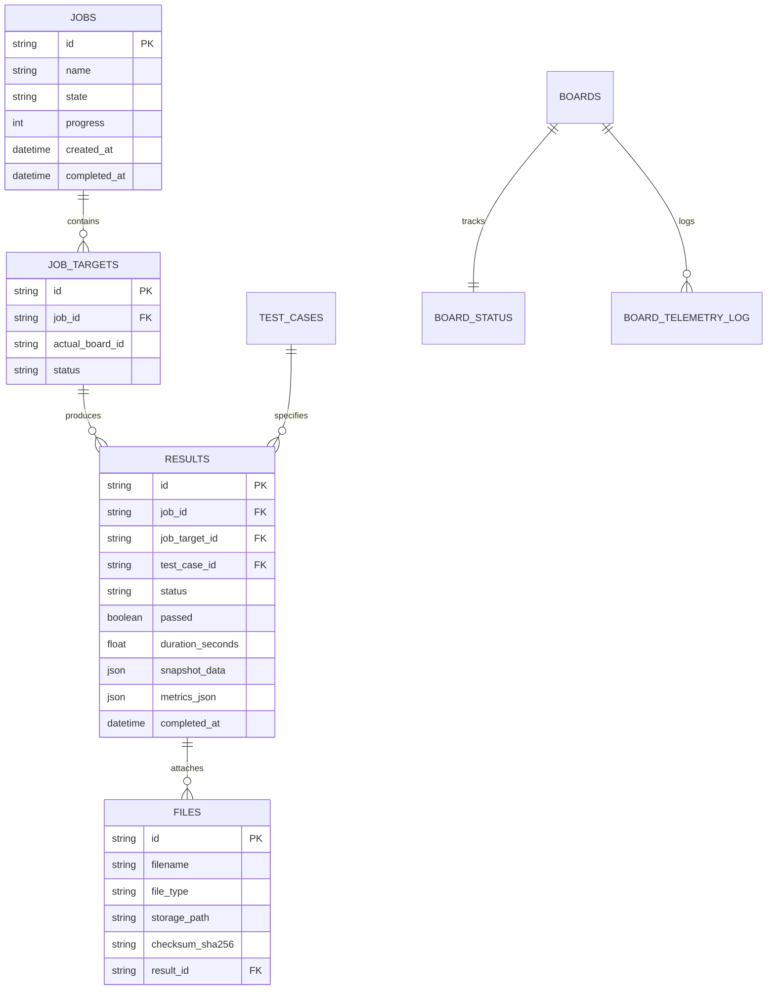

# 📋 Production Handoff Documentation
## Central Semiconductor Test Platform & FPGA Fleet Management (V2)

---

### 1. 🌐 System Overview & Architecture

The **Automate-Eval-System-V2-P3** is an enterprise-grade semiconductor evaluation and automated test platform. It coordinates hardware test runs, captures multi-channel high-speed digital/analog waveforms via **Xilinx Kria KR260 FPGA PL DMA**, and visualizes them on a high-performance web interface.

```mermaid
flowchart TB
    subgraph Frontend["Frontend (React 18 + Vite)"]
        UI_Home["Dashboard & Fleet Overview"]
        UI_Library["File Library (.ist, .erom, .ulp, .bin, .txt)"]
        UI_RunSet["Run Set & Batch Dispatcher"]
        UI_Waveform["Waveform Viewer (60fps Canvas + Quick Finder)"]
    end

    subgraph CentralServer["Central Platform (Docker: eval-system-dev @ Host Port 8000)"]
        API_Gateway["FastAPI Gateway & REST Routes"]
        Job_Queue["Job Queue Engine & Allocator"]
        Result_Store["Result Store & Normalizer"]
        Waveform_Proc["Waveform Ingestion (LZ4 Storage -> In-Memory Convert -> HDF5 & VCD)"]
        DB[(PostgreSQL Database)]
        Storage[(NVMe Storage: uploads/)]
    end

    subgraph HardwareFleet["FPGA Hardware Fleet (KR260 @ 192.168.1.111)"]
        Agent_Daemon["Board Agent (systemd: board-agent.service)"]
        AXI_DMA["AXI DMA S2MM Engine (0xA0000000)"]
        DDR_RAM["High-Speed DDR4 RAM Buffer (0x800000000)"]
        FPGA_PL["FPGA PL Core & Hex Loader (0xA0020000)"]
    end

    Frontend <-->|REST API & WebSockets| API_Gateway
    API_Gateway --> Job_Queue
    Job_Queue --> DB
    Job_Queue -->|POST /execute| Agent_Daemon
    Agent_Daemon -->|POST /api/agent/heartbeat| API_Gateway
    Agent_Daemon -->|DMA Stream| DDR_RAM
    DDR_RAM -->|RAM-to-LZ4| Agent_Daemon
    Agent_Daemon -->|POST /v1/upload (Chunked)| Waveform_Proc
    Waveform_Proc --> Storage
    Waveform_Proc --> Result_Store
    Result_Store --> DB
```

---

### 2. 🔌 Network & Hardware Configuration Matrix

| Component | IP Address / Host | Port / Protocol | Credentials / Details |
| :--- | :--- | :--- | :--- |
| **Central Platform (Host)** | `192.168.1.103` (`localhost`) | `8000` (HTTP / WS) | Central Docker container `eval-system-dev` |
| **KR260 FPGA Board** | `192.168.1.111` | `22` (SSH), `8000` (Agent API) | User: `petalinux` / Pass: `Sic1219!` |
| **KR260 Board ID** | `kr260-28d429` | MAC: `00:0A:35:28:D4:29` | Model: `kr260` (PetaLinux 2025.1) |
| **PostgreSQL DB** | `db` (internal Docker, container `eval-system-db-dev`) | `5432` | DB: `eval_system`, User: `eval_admin` |

#### Hardware Memory-Mapped Registers (KR260 PL):
* **AXI DMA S2MM Base**: `0xA0000000` (Control / Status registers)
* **BD Ring Base (Physical)**: `0x7F000000` (Buffer Descriptors)
* **Data Buffer Base (Physical)**: `0x800000000` (Direct DDR RAM buffer)
* **FPGA Hex Loader / Trigger Base**: `0xA0020000`
* **Dynamic Captured Length Register**: `0xA0020028`

---

### 3. 🛠️ Key Implemented Modules & Features

#### 📁 A. File Library & Whitelist Customization
* **Allowed File Whitelist**: Strictly restricted to `['ist', 'erom', 'ulp', 'bin', 'txt']`. Obsolete `.vcd`, `.hex`, `.elf`, `.lin`, `.sh` extensions have been removed from the UI import dialog.
* **Standalone Stimulus Support**: Single `.ist` files can be uploaded and dispatched as independent test cases without requiring `.erom` or `.ulp` firmware binaries.

#### 🎛️ B. Board Fleet Manager & Live Telemetry
* **Real-time Monitoring**: Heartbeat every 5s capturing CPU Temperature (°C), CPU Load (%), RAM Usage (MB), and FPGA PL status.
* **Management Controls**: Real-time board rename, delete confirmation modal, and heartbeat-aware online/offline tracking.

#### ⚡ C. End-to-End Automated Hardware Execution Pipeline
1. **Dispatch**: User clicks *Run* $\rightarrow$ Backend assigns `JobORM` and `ResultORM` records $\rightarrow$ Dispatches `POST /execute` to KR260 Agent.
2. **Hardware Capture**:
   * KR260 Agent arms the **AXI DMA S2MM Scatter-Gather Engine**.
   * Clears DDR RAM buffer and executes `.ist` stimulus via mmap register triggers.
   * Streams captured binary bytes directly into compressed `scope_capture.bin.lz4` in zero-wear RAM disk (`/tmp/board_data`).
3. **Upload, Storage & Conversion (Ephemeral Raw Binary Architecture)**:
   * Agent uploads `.bin.lz4` chunks to `/v1/upload/init`, `/v1/upload/part`, `/v1/upload/complete`.
   * **Storage Policy**: Central Server stores **`result_{id}_capture.bin.lz4`** (~6 MB) as permanent lossless ground truth.
   * **In-Memory/Tmp Conversion**: Server decompresses LZ4 temporarily $\rightarrow$ Generates canonical **HDF5 (`.h5` ~18 MB)** for Web UI & Python, and **VCD (`.vcd` ~0.7 MB)** for GTKWave.
   * **Immediate Purge**: The temporary 1.46 GB raw `.bin` is deleted immediately (`os.remove`), saving >98.5% server disk space.
   * Automatically marks `ResultORM.status = "completed"`, `passed = True`, and registers `FileORM` records.

#### 📈 D. Interactive Waveform Viewer & Quick Finder
* **Searchable Combobox (Quick Finder)**: Floating searchable selector with instant filter chips:
  * `All (N)`
  * `Passed (N)`
  * `Failed (N)`
  * `KR260 (N)`
* **High-Performance Canvas**: 60 FPS multi-channel hardware trace rendering with dynamic downsampling from HDF5.
* **Measurement Tools**: Dual interactive measurement cursors for $\Delta T$, $\Delta V$, $V_{pp}$, Frequency, and Duty Cycle calculation.
* **Hardware Artifact Export**: One-click download for **HDF5 (`.h5`)**, **VCD (`.vcd`)**, and **LZ4 (`.bin.lz4`)**. Downloading compressed LZ4 eliminates network bandwidth bottlenecks.

---

### 4. 🗄️ Database Architecture & Key ORM Entities



---

### 5. 🚀 Deployment & Operations Playbook

#### 1️⃣ How to Build & Deploy Central Platform (Backend + Frontend):
```powershell
# In project root: d:\siliconcraft\eval_system\V2\Automate-Eval-System-V2-P3
cd d:\siliconcraft\eval_system\V2\Automate-Eval-System-V2-P3

# 1. Build Frontend
npm run build

# 2. Sync to Docker & Restart
docker cp frontend/dist/. eval-system-dev:/app/frontend/
docker cp backend/. eval-system-dev:/app/
docker restart eval-system-dev
```

#### 2️⃣ How to Deploy Complete Codebase to KR260 FPGA Board:
We have built an automated deployment script that syncs all python modules, sets up the systemd daemon, and restarts the service:
```powershell
python backend/tests/deploy_all_to_kr260.py
```

*Manual Board Commands (via SSH `petalinux@192.168.1.111`):*
```bash
# Check Agent Service Status
sudo systemctl status board-agent

# View Real-Time Agent Logs
sudo journalctl -u board-agent -f

# Restart Agent Service
sudo systemctl restart board-agent
```

#### 3️⃣ How to Run Automated End-to-End Test Verification:
```powershell
python backend/tests/run_fresh_hardware_test.py
```

---

### 6. 📂 Key File Sitemap & Code References

#### Central Platform Backend:
* [routers/agent_results.py](file:///d:/siliconcraft/eval_system/V2/Automate-Eval-System-V2-P3/backend/routers/agent_results.py) — Chunked upload receiver, LZ4 decompressor, HDF5/VCD converter.
* [routers/boards.py](file:///d:/siliconcraft/eval_system/V2/Automate-Eval-System-V2-P3/backend/routers/boards.py) — Board telemetry, measurements receiver, reboot/delete endpoints.
* [services/result_store.py](file:///d:/siliconcraft/eval_system/V2/Automate-Eval-System-V2-P3/backend/services/result_store.py) — Database result querying, `nulls_last` sorting, and snapshot mapping.
* [services/job_queue.py](file:///d:/siliconcraft/eval_system/V2/Automate-Eval-System-V2-P3/backend/services/job_queue.py) — Hardware job allocation, board locking, and run sequencing.
* [services/board_manager.py](file:///d:/siliconcraft/eval_system/V2/Automate-Eval-System-V2-P3/backend/services/board_manager.py) — Fleet inventory, heartbeat handler, and dispatch client.

#### Frontend Application:
* [WaveformPage.jsx](file:///d:/siliconcraft/eval_system/V2/Automate-Eval-System-V2-P3/frontend/src/pages/WaveformPage.jsx) — Waveform Viewer, Quick Finder search combobox, dual cursor measurements.
* [FileLibraryPage.jsx](file:///d:/siliconcraft/eval_system/V2/Automate-Eval-System-V2-P3/frontend/src/pages/FileLibraryPage.jsx) — File manager with updated whitelist (`.ist`, `.erom`, `.ulp`, `.bin`, `.txt`).
* [BoardsPage.jsx](file:///d:/siliconcraft/eval_system/V2/Automate-Eval-System-V2-P3/frontend/src/pages/BoardsPage.jsx) — Fleet inventory management, live telemetry charts, board rename/delete.
* [TestCasesPage.jsx](file:///d:/siliconcraft/eval_system/V2/Automate-Eval-System-V2-P3/frontend/src/pages/TestCasesPage.jsx) — Test Case grouping and `.ist` stimulus mapping.
* [RunSetPage.jsx](file:///d:/siliconcraft/eval_system/V2/Automate-Eval-System-V2-P3/frontend/src/pages/RunSetPage.jsx) — Run Set creation and execution sequence manager.

#### KR260 FPGA Board Agent:
* [main.py](file:///d:/siliconcraft/eval_system/V2/fpga_interface/board_agent/main.py) — FastAPI board daemon, `/execute`, `/health`, `/telemetry`.
* [runner.py](file:///d:/siliconcraft/eval_system/V2/fpga_interface/board_agent/runner.py) — Execution pipeline: download $\rightarrow$ flash $\rightarrow$ capture $\rightarrow$ upload $\rightarrow$ cleanup.
* [backend_client.py](file:///d:/siliconcraft/eval_system/V2/fpga_interface/board_agent/backend_client.py) — Chunked result uploader, heartbeat sender, asset downloader.
* [axidma_driver.py](file:///d:/siliconcraft/eval_system/V2/fpga_interface/board_agent/axidma_driver.py) — Direct `/dev/mem` AXI DMA Scatter-Gather engine driver.
* [simulator.py](file:///d:/siliconcraft/eval_system/V2/fpga_interface/board_agent/simulator.py) — `PLDmaCapture` hardware driver and instruction triggers.
* [agent.toml](file:///d:/siliconcraft/eval_system/V2/fpga_interface/board_agent/agent.toml) — Board configuration file (`backend_url = "http://192.168.1.103:8000"`).

---

### 7. 🔍 E2E Testing Bottlenecks, Root Cause Analysis & Solutions

During initial End-to-End hardware testing between the Central Platform and the KR260 board, the following 6 core issues were identified, diagnosed, and resolved:

> **Correction (2026-09-02):** despite issues #1–#6 below being fixed, no job dispatched from the UI ever actually completed a real hardware run before this date — every "completed" result in the database up to this point was seeded by test scripts (`create_sample_h5_result.py`, `seed_multiple_waveform_results.py`), not produced by the pipeline. Issues #7–#11 were found while getting the *first* genuine UI-triggered hardware run to complete end-to-end (job `17b9e757` / `79019b34`), and are the ones that actually blocked real usage.

| # | Issue / Symptom | Root Cause Analysis | Engineering Solution Applied |
| :- | :--- | :--- | :--- |
| **1** | **KR260 Agent Startup Crash**<br>`[Errno 98] address already in use` | A lingering process run by `root` was holding port 8000. `petalinux` user lacked kill permissions. | Configured a persistent **`systemd` service (`board-agent.service`)** running as `root` with automatic restart. |
| **2** | **Board Rejection of Standalone `.ist` Files**<br>`fw_url or fw_file_id is required` | `main.py` enforced a mandatory firmware binary (`.erom`) and raised `ValueError` when dispatching standalone `.ist`. | Modified `ExecuteRequest` and `runner.py` to make **firmware download & flashing optional**, enabling standalone `.ist` runs. |
| **3** | **Result Upload Protocol Failure**<br>`httpx.UnsupportedProtocol: Request URL missing http://` | `backend_client.upload_result()` did not auto-prefix `http://` when receiver URLs were passed as raw hostnames or IPs. | Added automatic protocol prefixing (`http://`) and parameter support for `receiver_url` across all API callers. |
| **4** | **RAM Disk Exhaustion during DMA Stream**<br>`[Errno 28] No space left on device` | AXI DMA driver configured `1500 BDs * 1MB = 1500 MB`, but KR260 `/tmp` (tmpfs RAM disk) is only `944 MB`. | Reduced BD ring to **100 BDs (100 MB max)** and added fallback capture clamping to **10 MB default** to prevent disk overflow. |
| **5** | **Agent Host Disconnection**<br>`[Errno -2] Name or service not known` | `agent.toml` was configured to `http://eval-backend.local:8000` which failed without an active mDNS resolver. | Set explicit host IP: `backend_url = "http://192.168.1.103:8000"` in `agent.toml`. |
| **6** | **Waveform Results Missing from Dropdown**<br>`Waveform file not found` / Missing list | In PostgreSQL, `ORDER BY completed_at DESC` puts `NULL` values at the top (`NULLS FIRST`), pushing completed items down. | Updated queries in `result_store.py` to use `.nulls_last()`, ensuring completed waveform results appear at the top. |
| **7** | **Run button always fell back to a fake in-memory simulation**<br>Job showed "Complete" but no board was ever contacted, no file uploaded | `job_queue_service` (the real hardware dispatcher) was never `.start()`ed at app boot — only `.initialize()` was called. `routers/jobs.py`'s Run handler gated the real enqueue path on `job_queue_service._running`, which was always `False`, so it silently fell through to `_simulate_job()`, a `random.random() < 0.2` pass/fail mock. | Removed the `_running` gate; Run now always enqueues to `JobORM.state="pending"`. `pending_job_dispatcher` (already started unconditionally in `main.py`'s lifespan) picks up pending targets and dispatches them to real hardware via `job_queue_service._execute_target()`, independent of `_running`. `_simulate_job()` code kept in place but is now unreachable from Run. |
| **8** | **Stimulus file 404 on dispatch**<br>`404 Not Found` for `/api/files/{id}/content` even though the file existed in the DB | A test-data seeding script (`tests/create_sample_h5_result.py`) inserted a `FileORM` row pointing at a flat `storage_path` with no file ever written to disk. `_precreate_results_from_pairs` resolves stimulus by filename + newest `uploaded_at`, so the fake row silently won over the real uploaded file of the same name. | Repointed the affected `TestCaseORM.vcd_file_id` to the real file and deleted the orphaned `FileORM` row. **Not fixed at the root**: any future same-named seed/duplicate row can still shadow a real file this way — flagged, not patched, in this pass. |
| **9** | **`ModuleNotFoundError: No module named 'lz4'` on every upload**<br>`500` on `/v1/upload/complete/...` | The `lz4` Python package was never in `backend/requirements.txt`, so it was never installed in the image. Every board-agent upload failed at the LZ4 decompression step — meaning **no capture had ever made it through this endpoint successfully** prior to this fix. | Added `lz4>=4.0.0` to `requirements.txt`, rebuilt the `eval-system:latest` image (`docker compose build eval && docker compose up -d eval`) so it's installed permanently, not just hot-patched into a running container. |
| **10** | **Waveform preview/list endpoints 500'd with `MultipleResultsFound`** | `agent_results.py` writes *both* the `.h5` and the `.vcd` artifact as `FileORM` rows with the same `file_type=WAVEFORM`. Every query in `result_store.py` that looked up "the" waveform file used `.scalar_one_or_none()`, which throws once a result has both files. | Added a `FileORM.storage_path.like("%.h5")` filter to all 4 affected queries in `result_store.py` so they resolve to the HDF5 record only. (The `.vcd` `FileORM` row is otherwise unused — `export?format=vcd` derives the VCD path from the `.h5` path directly rather than querying it.) |
| **11** | **`job_queue.py` marked a job "Complete" even when every test case errored** | After the per-test-case loop, the target/job finalization block set `status="completed"` / `state="completed"` unconditionally — it never checked whether any run actually passed. This is the "job shows Complete but nothing came back" symptom users hit directly. | Added an `any_failed` accumulator across the loop; the target/job now finalize to `"failed"` / `current_step="Completed with errors"` when any test case didn't pass, instead of always reporting success. |

**Also found, not fixed in this pass:** `services/result_store.get_waveform()` (the non-preview, full-resolution `/results/{id}/waveform` endpoint — not used by the Waveform Viewer UI, which uses `/preview` instead) still returns empty channels for the flat `"raw"` HDF5 schema the agent writes. A fix was attempted and reverted after it caused a full server outage: materializing tens of millions of samples as Python dicts inside the async request handler with no `asyncio.to_thread` blocked the event loop entirely (health checks and board heartbeats stopped responding). Any real fix needs a `max_samples`/downsampling parameter on that endpoint before touching the reader logic again.

