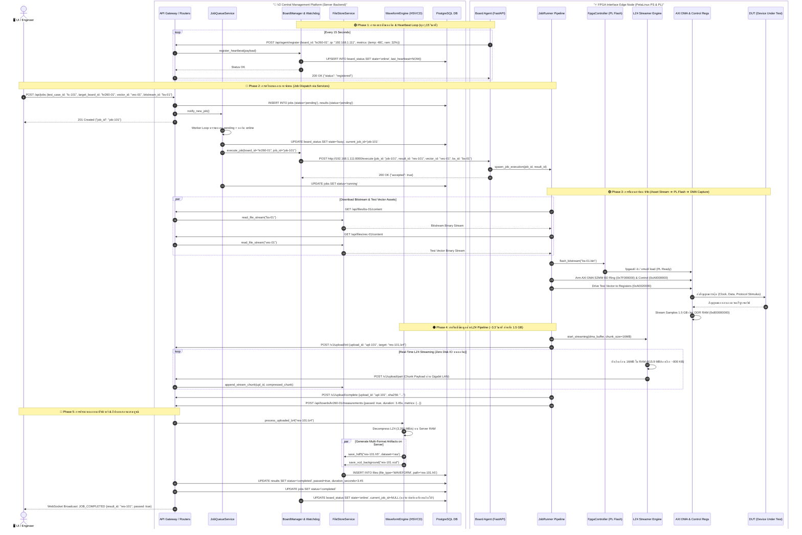
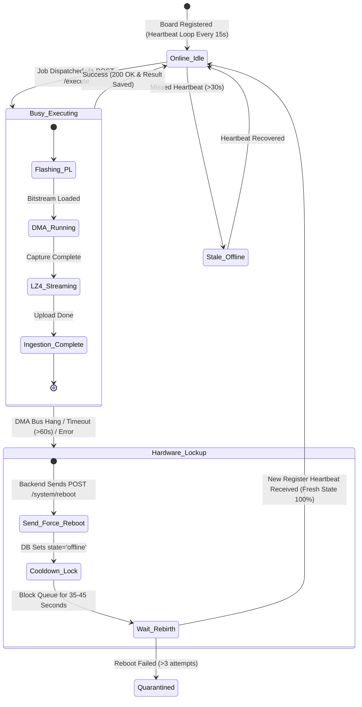

# เอกสารนำเสนอสถาปัตยกรรมระบบหลังบ้านฉบับสมบูรณ์และละเอียดที่สุด
## (Master Backend System Architecture Specification for Presentation)

**โครงการ:** SiliconCraft Automate Evaluation System Platform (V2 Platform & FPGA Edge Node)  
**วันที่จัดทำ:** 26 สิงหาคม 2026 | **สถานะ:** Official Master Presentation Blueprint

---

## 1. ผังรวมสถาปัตยกรรมระดับละเอียดสูงสุด (Ultra-Detailed Master Backend Flowchart)

แผนผังแสดงโครงสร้างภายในของทุกโมดูล, Services, พอร์ตการเชื่อมต่อ, การแมปหน่วยความจำฮาร์ดแวร์ (Memory Map), ฐานข้อมูล และเส้นทางการไหลของข้อมูลแบบสมบูรณ์:

```mermaid
flowchart TB
    %% =========================================================================
    %% PRESENTATION & CLIENT LAYER
    %% =========================================================================
    subgraph Layer_Clients ["🌐 1. Presentation & External Access Layer"]
        direction LR
        FE_App["🖥️ React Dashboard UI\n(Vite / Tailwind / Zustand)\n• Waveform Scope (60fps Canvas)\n• Board Management & Fleet\n• Artifacts Download & Tolerances"]
        WebSSH_Term["💻 WebSSH Terminal (xterm.js)\n• Direct Linux Console Proxy\n• Live Telemetry Gauge"]
        Local_WebUI["📱 KV/KR Local WebApp\n(Port 8000 WebUI - Standalone)"]
        CLI_Curl["⌨️ Local CLI / cURL API\n(Direct LAN Automation)"]
    end

    %% =========================================================================
    %% V2 CENTRAL PLATFORM BACKEND
    %% =========================================================================
    subgraph Central_Platform ["🏢 2. V2 Central Management Server (FastAPI Backend - Port 8000)"]
        direction TB
        
        subgraph Ingress_Routers ["API Ingress & Routers (/api)"]
            R_Boards["routers/boards.py\n• Board CRUD\n• WebSSH Proxy\n• Measurements"]
            R_Jobs["routers/jobs.py\n• Create/Cancel Jobs\n• Priority Queue"]
            R_Upload["routers/agent_results.py\n• /v1/upload/init|part|complete\n• /v1/upload/stream (LZ4)"]
            R_Files["routers/files.py\n• Bitstreams & Vectors Library"]
            R_WS["routers/ws.py\n• Real-Time Broadcast\n(Job/Board State)"]
        end

        subgraph Core_Engine_Services ["Core Background Engines & Services"]
            direction TB
            JobQueue["⚙️ JobQueueService (services/job_queue.py)\n• Worker Loop (_execute_target)\n• State Transition (pending ➔ running ➔ done)\n• Board Assignment Algorithm"]
            BoardManager["📡 BoardManager & Watchdog (services/board_manager.py)\n• Heartbeat Registry (15s Window)\n• Auto-Watchdog (30s Timeout Check)\n• Force Reboot Dispatcher"]
            FileStore["📁 FileStoreService (services/file_store.py)\n• SHA-256 Checksum Validator\n• Directory Manager (uploads/WAVEFORM, REPORT)"]
            WaveformEngine["📈 WaveformEngine (services/waveform_file.py)\n• HDF5 Fast Slicer (raw dataset)\n• Server-Side VCD Converter (Multi-threaded)"]
            SSHProxyServer["🔒 WebSSH Proxy Service\n• Paramiko Keepalive Tunnel (Port 22)\n• Incremental UTF-8 Decoder"]
        end

        subgraph Central_Persistence ["Data Storage & Persistence"]
            DB_Postgres[("🗄️ PostgreSQL Database\n• boards & board_status\n• jobs & test_cases\n• results & files")]
            Disk_Storage[("💾 High-Speed Storage (NVMe SSD)\n• uploads/WAVEFORM/{year}/{month}/*.h5\n• uploads/REPORT/*.csv\n• uploads/LOG/*.log")]
        end

        Ingress_Routers <--> Core_Engine_Services
        Core_Engine_Services <--> DB_Postgres
        Core_Engine_Services <--> Disk_Storage
    end

    %% =========================================================================
    %% TRANSPORT & NETWORK INTERCONNECT
    %% =========================================================================
    subgraph Transport_Layer ["🌐 3. High-Speed Transport Layer (Gigabit Ethernet 1 Gbps / SFP+)"]
        direction LR
        REST_Control["HTTP/1.1 REST Control\n• POST /execute\n• POST /system/reboot\n• POST /api/agent/register"]
        LZ4_Stream["🚀 High-Speed LZ4 Binary Stream\n• 615.9 MB/s Compression\n• ~3-5s for 1.5 GB\n• Chunked Transfer Encoding"]
        SSH_TCP["🔐 SSH Protocol Tunnel\n• TCP Port 22 (Keepalive 10s)"]
    end

    %% =========================================================================
    %% FPGA INTERFACE EDGE NODE
    %% =========================================================================
    subgraph FPGA_Edge_Node ["⚡ 4. FPGA Interface Edge Node (KR260 / KV260 / Zybo)"]
        direction TB

        subgraph PetaLinux_PS ["Linux Processing System (PetaLinux PS - 4x ARM Cortex-A53)"]
            direction TB
            Agent_Daemon["🤖 board_agent (FastAPI Daemon - Root)\n• Port 8000 Listener\n• Lifespan Loop"]
            
            subgraph Agent_Internal_Modules ["Agent Internal Subsystems"]
                Runner["JobRunner Engine (runner.py)\n• Pipeline Lock (busy flag)\n• Asset Downloader & Cache\n• Test Sequence Controller"]
                HTTPX_Client["BackendClient (backend_client.py)\n• Heartbeat Loop (Every 15s)\n• Telemetry Reporter\n• LZ4 Chunked Uploader"]
                LZ4_Engine["🚀 LZ4 Fast Compression Engine\n• lz4.frame (615.9 MB/s)\n• Direct RAM-to-Socket Streaming"]
                FpgaCtrl["FPGA Controller (hardware.py)\n• xmutil load / fpgautil -b\n• Bitstream Manager"]
                ResetCtrl["Hardware Reset Controller\n• 0xA0020000 devmem Pulse\n• GPIO Line Toggle"]
                Sensors["System Metrics (metrics.py)\n• Thermal (/sys/class/thermal)\n• RAM (/proc/meminfo)\n• FPGA Status"]
            end

            subgraph SD_Sync_Storage ["Local Edge Storage"]
                SD_Card[("💾 SD Card Storage\n/mnt/sdcard/eval_standalone/\n• pending_sync/ (manifest.json)\n• test_vectors/ & bitstreams/")]
            end

            Agent_Daemon <--> Agent_Internal_Modules
            Agent_Internal_Modules <--> SD_Sync_Storage
        end

        subgraph FPGA_PL_Hardware ["FPGA Programmable Logic (PL Hardware Layer)"]
            direction TB
            
            subgraph AXI_Subsystem ["AXI Memory & Control Subsystem"]
                AXI_DMA_Ctrl["📡 AXI DMA Engine Controller\n(Physical Addr: 0xA0000000)"]
                BD_Ring_Mem["📋 Scatter-Gather BD Ring\n(Physical Addr: 0x7F000000 - 16 MB)"]
                DDR_Sample_RAM["🧠 High-Speed DDR Sample Memory\n(Physical Addr: 0x800000000 - 2 GB)"]
                Control_Regs["🎛️ Custom Stimulus & Reset Registers\n(Physical Addr: 0xA0020000)"]
            end

            subgraph DUT_Interface ["DUT Physical Interface"]
                DUT_Device["🔌 DUT (Device Under Test)\n• CML Differential High-Speed\n• SPI / I2C / UART Bus\n• GPIO Control Pins"]
            end

            AXI_DMA_Ctrl <--> BD_Ring_Mem
            AXI_DMA_Ctrl <--> DDR_Sample_RAM
            Control_Regs --> DUT_Device
            DUT_Device <--> AXI_DMA_Ctrl
        end

        %% PS to PL Interconnect
        Runner -- "mmap /dev/mem" --> AXI_DMA_Ctrl
        Runner -- "mmap /dev/mem" --> Control_Regs
        FpgaCtrl -- "fpgautil / xmutil" --> FPGA_PL_Hardware
        ResetCtrl -- "devmem write" --> Control_Regs
        DDR_Sample_RAM -- "Zero-Copy RAM Read" --> LZ4_Engine
    end

    %% =========================================================================
    %% CROSS-LAYER CONNECTIONS
    %% =========================================================================
    FE_App <==> Ingress_Routers
    WebSSH_Term <==> SSHProxyServer
    Local_WebUI <==> Agent_Daemon
    CLI_Curl <==> Agent_Daemon

    Ingress_Routers <==> REST_Control <==> Agent_Daemon
    Ingress_Routers <==> LZ4_Stream <== LZ4_Engine
    SSHProxyServer <==> SSH_TCP <==> PetaLinux_PS
```

---

## 2. ลำดับการทำงานตั้งแต่เริ่มจนจบแยกตาม Service (Service-Level End-to-End Sequence Diagram)

แผนผัง Sequence Diagram แสดงการสื่อสารระหว่าง **Services ภายใน V2 Central Backend** และ **Subsystems ภายใน FPGA Board Agent** ทุกขั้นตอน:



---

## 3. ผังท่อส่งข้อมูลในหน่วยความจำระดับ Zero-Disk Bottleneck (Data & Memory Pipeline)

แผนผังแสดงโครงสร้างการเคลื่อนที่ของข้อมูลตั้งแต่ระดับ Physical Memory ในชิป จนถึง Dashboard หน้าเว็บ โดย **ไม่ผ่านการเขียนไฟล์ดิบลง SD Card ของบอร์ด**:

```mermaid
flowchart LR
    subgraph Step1 ["1. PL Hardware Space"]
        DUT["DUT Pins"] --> AXI_DMA["AXI DMA Engine\n(0xA0000000)"]
        AXI_DMA --> DDR["Physical DDR RAM\n(0x800000000)\n1.5 GB Raw Data"]
    end

    subgraph Step2 ["2. PS Linux Kernel & User Space"]
        DDR -- "mmap /dev/mem\n(Circular Buffer 32MB)" --> CPU_Cache["ARM Cortex-A53\nCPU L1/L2 Cache"]
        CPU_Cache --> LZ4["LZ4 Compressor\n(615.9 MB/s)\nลดเหลือ ~80 MB"]
        LZ4 --> Socket_Buf["Linux TCP Socket Buffer"]
    end

    subgraph Step3 ["3. Network Transport"]
        Socket_Buf -- "Gigabit LAN (95 MB/s)\nใช้เวลา ~0.85s" --> Server_Socket["Server TCP Socket Buffer"]
    end

    subgraph Step4 ["4. Central Server RAM & Storage"]
        Server_Socket --> LZ4_Dec["Server LZ4 Decompressor\n(3,200 MB/s)"]
        LZ4_Dec --> Mem_Buf["Server Memory Buffer"]
        Mem_Buf --> H5["HDF5 Waveform (.h5)\n(Dataset 'raw')"]
        Mem_Buf --> VCD["VCD Logic Trace (.vcd)"]
        Mem_Buf --> CSV["Summary Metrics (.csv)"]
    end

    subgraph Step5 ["5. Web Presentation"]
        H5 --> WebGL["WebGL Scope Viewer (60fps)\n(HighPerformanceWaveformViewer)"]
        CSV --> Table["Pass/Fail Tolerances Table\n(MultiArtifactDownloadPanel)"]
    end
```



---

## 4. กลไกการจัดการข้อผิดพลาดและ Watchdog State Machine (Fault Recovery)



---

## 5. ตารางสรุปจุดเด่นทางเทคนิคสำหรับใช้นำเสนอ (Key Presentation Highlights)

| หัวข้อ (Topic) | จุดเด่นของสถาปัตยกรรม (Architectural Highlight) | ประโยชน์เชิงวิศวกรรม (Engineering Benefit) |
| :--- | :--- | :--- |
| **1. Throughput & Speed** | ใช้ **LZ4 Streaming Pipeline (615.9 MB/s)** บีบอัดข้อมูล 1.5 GB เหลือ ~80 MB | ลดเวลาส่งข้อมูลจาก 16 วินาทีเหลือ **~3.3 วินาที** (เร็วขึ้นเกือบ 5 เท่า) |
| **2. Edge & Server Offloading** | ย้ายงานแปลง `.vcd` และ `.h5` มาทำบน CPU Multi-core ของคอมกลาง | ลดเวลาติดสถานะ Busy ของบอร์ดจาก **3 ชั่วโมง เหลือเพียง ~4 วินาที** |
| **3. Hardware Safety & Lifespan** | สตรีมข้อมูลตรงจาก **DDR RAM ➔ Network** แบบ Zero-Copy | ป้องกันปัญหา **SD Card เสื่อมสภาพ** จากการเขียนไฟล์ดิบ 12+ GB ซ้ำๆ |
| **4. Dual Mode Operation** | รองรับทั้ง **V2 Connected Mode** (คิวงานกลาง) และ **Standalone Mode** (ออฟไลน์หน้างาน) | บอร์ดทำงานได้อย่างอิสระ บันทึกผลลง SD Card พร้อมรองรับการ Sync ย้อนหลัง |
| **5. Fault Recovery** | ระบบ **Force Board Reboot** + Watchdog Sweeper ทุก 15 วินาที พร้อม Cooldown 35s | คืนสภาวะ AXI Bus และ Physical Memory ให้สะอาด 100% ก่อนเริ่มงานใหม่ |
| **6. Interactive Web UI** | **WebGL/Canvas Waveform Scope (60fps)** พร้อม Dual Measurement Cursors ($X_1, X_2, \Delta t$) | วิเคราะห์สัญญาณความเร็วสูงและ Bus Decoder (Hex) ได้บนเบราว์เซอร์ทันที |
