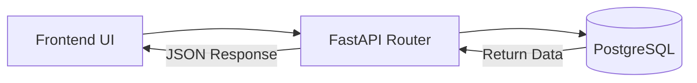
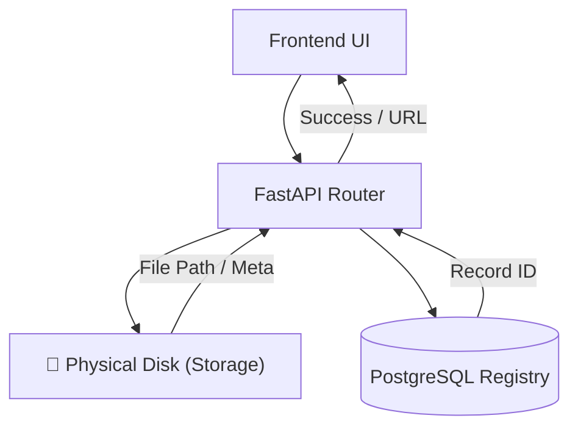
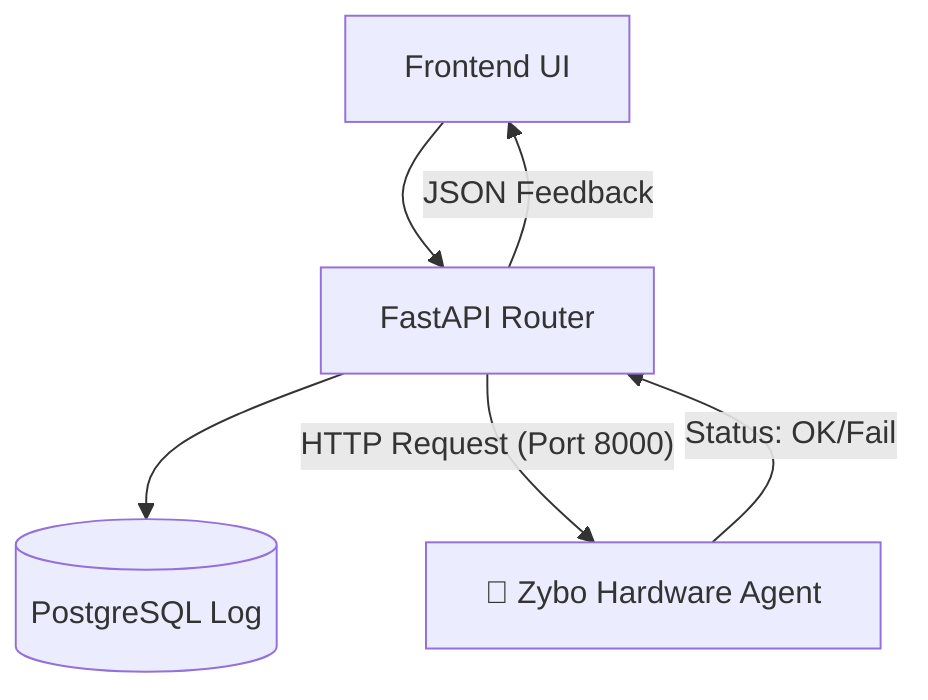
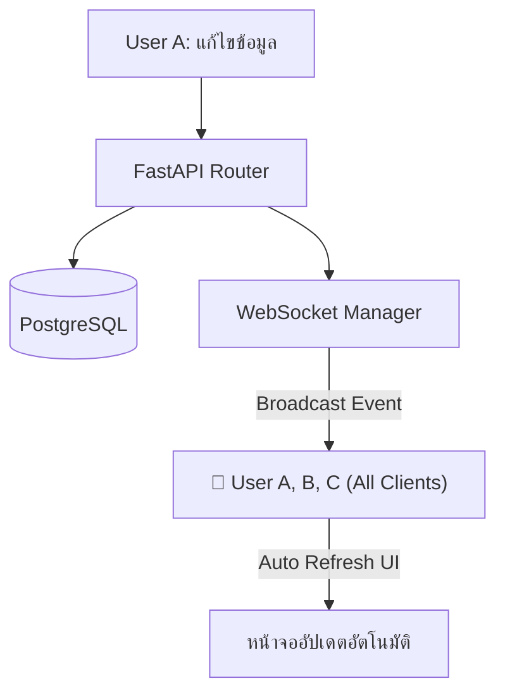

# รูปแบบการไหลของข้อมูล API (API Flow Patterns)
**สถานะ:** สถาปัตยกรรมอ้างอิง (Reference Architecture)

[กลับสู่หน้าหลักสถาปัตยกรรมระบบ (System Architecture & Data Mapping)](./FE_MENU_API_DB_MAPPING.md)

---

## 1. รูปแบบ CRUD พื้นฐาน (Simple Database Interaction)
ใช้สำหรับดึงข้อมูล (GET) หรือลบข้อมูล (DELETE) ที่ไม่มีความซับซ้อน

- **ตัวอย่าง API:** `getJobs()`, `getBoards()`, `deleteResult()`, `getNotifications()`
- **จุดสำคัญ:** เน้นความเร็วและลดการ Join ตารางที่ซับซ้อนเกินไป

---

## 2. รูปแบบจัดการไฟล์และพื้นที่เก็บข้อมูล (File & Storage Flow)
ใช้เมื่อมีการอัปโหลดไฟล์จริงเข้าสู่เซิร์ฟเวอร์ หรือการลบไฟล์ออกจาก Disk

- **ตัวอย่าง API:** `uploadFile()`, `deleteFile()`, `getResultWaveform()`
- **จุดสำคัญ:** มีการทำงาน 2 ส่วนเสมอคือ (1) บันทึกไฟล์จริง และ (2) บันทึกที่อยู่ไฟล์ (Path) ลงใน Database

---

## 3. รูปแบบการควบคุมฮาร์ดแวร์ (Hardware Interaction Flow)
ใช้เมื่อต้องส่งคำสั่งควบคุมไปยังบอร์ด Zybo ผ่านระบบเน็ตเวิร์ก

- **ตัวอย่าง API:** `rebootBoard()`, `startJob()`, `updateBoardFirmware()`
- **จุดสำคัญ:** Backend ทำหน้าที่เป็น Bridge ส่งผ่านคำสั่งจาก User ไปยังบอร์ด และรอรับผลยืนยันจาก Agent

---

## 4. รูปแบบการอัปเดตแบบ Real-time (WebSocket Broadcast Flow)
ใช้เมื่อมีการแก้ไขข้อมูลที่สำคัญ ซึ่งต้องให้ผู้ใช้งานทุกคนเห็นการเปลี่ยนแปลงทันที

- **ตัวอย่าง API:** `updateJob()`, `createBoard()`, `markNotificationRead()`
- **จุดสำคัญ:** ใช้หลักการ **Write to DB + Broadcast to WS** เพื่อให้สถานะข้อมูล (State) ตรงกันทั้งระบบโดยไม่ต้องรีเฟรช

---
> **สรุป:** การออกแบบ API แบบ Pattern-based ช่วยให้ Developer ใหม่เข้าใจระบบได้เร็วขึ้น เพราะไม่ต้องไล่ดูโค้ดทีละบรรทุก แต่ให้มองที่ "กลุ่มการทำงาน" แทนครับ
