# เอกสารแสดงโครงสร้างความสัมพันธ์ของระบบ (System Architecture & Data Mapping)
**สถิติระบบ:** 7 เมนูหลัก | 84 API ฟังก์ชันใน source code ปัจจุบัน | 13 ตารางฐานข้อมูลปัจจุบัน

แผนผังนี้แสดงโครงสร้างทั้งระบบ ตั้งแต่หน้าจอผู้ใช้ไปจนถึงการจัดเก็บข้อมูลเชิงลึกในระดับฟิลด์

> **หมายเหตุการออกแบบ:** แผนผังนี้เป็นภาพรวมของระบบปัจจุบันเพื่อใช้ mapping และ audit ไม่ใช่ target architecture สุดท้ายทั้งหมด หลัง redesign ควรลด source of truth ซ้ำซ้อน โดยยึด canonical flow: `profiles/files/test_cases/test_suites/boards/board_status/jobs/job_targets/job_items/results/result_files` และลดบทบาท `job_files`, `pairs_data`, profile JSON test data, และ tag fields ที่กระจายหลายตาราง

```mermaid
graph TD
    %% ==========================================
    %% 1. Frontend Menus
    %% ==========================================
    subgraph Menus ["เมนูหลัก Frontend"]
        M1[Dashboard]
        M2[Job Queue]
        M3[Devices Management]
        M4[File Library]
        M5[Test Management]
        M6[History & Results]
        M7[Setup & Profiles]
    end

    %% ==========================================
    %% 2. API Groups (All 84 Functions)
    %% ==========================================
    subgraph G1 ["System Health (5)"]
        A1[getHealth]:::crud
        A2[getSystemHealth]:::crud
        A3[getStorageStatus]:::crud
        A4[getBoardApiStatus]:::hardware
        A5[getMqttStatus]:::crud
    end

    subgraph G2 ["Boards (15)"]
        B1[getBoards]:::crud
        B2[getBoardById]:::crud
        B3[createBoard]:::sync
        B4[updateBoard]:::sync
        B5[deleteBoard]:::sync
        B6[getBoardStatus]:::hardware
        B7[getBoardTelemetry]:::hardware
        B8[rebootBoard]:::hardware
        B9[shutdownBoard]:::hardware
        B10[pauseBoardQueue]:::sync
        B11[resumeBoardQueue]:::sync
        B12[updateBoardFirmware]:::file
        B13[runBoardSelfTest]:::hardware
        B14[batchBoardActions]:::hardware
        B15[getBoardSSHConnection]:::sync
    end

    subgraph G3 ["Jobs & Queues (16)"]
        J1[getJobs]:::crud
        J2[getJobById]:::crud
        J3[createJob]:::sync
        J4[updateJob]:::sync
        J5[startJob]:::hardware
        J6[stopJob]:::hardware
        J7[stopAllJobs]:::hardware
        J8[exportJob]:::file
        J9[runCommand]:::hardware
        J10[reorderJob]:::sync
        J11[updateJobTag]:::sync
        J12[deleteJob]:::sync
        J13[uploadJob]:::file
        J14[startJobQueue]:::hardware
        J15[stopJobQueue]:::hardware
        J16[getJobStatusSummary]:::crud
    end

    subgraph G4 ["Job Files (6)"]
        JF1[getJobFiles]:::crud
        JF2[getJobPairs]:::crud
        JF3[stopJobFile]:::hardware
        JF4[rerunJobFile]:::hardware
        JF5[moveJobFile]:::sync
        JF6[deleteJobFile]:::sync
    end

    subgraph G5 ["Files Library (10)"]
        F1[checkFile]:::file
        F2[uploadFile]:::file
        F3[getFiles]:::crud
        F4[getFileById]:::crud
        F5[deleteFile]:::file
        F6[patchFileLibraryTags]:::sync
        F7[saveSetFiles]:::file
        F8[listSetFiles]:::crud
        F9[restoreSetFiles]:::file
        F10[deleteSet]:::file
    end

    subgraph G6 ["Profiles (8)"]
        P1[createProfile]:::crud
        P2[listProfiles]:::crud
        P3[getProfile]:::crud
        P4[getAllTests]:::crud
        P5[getProfileData]:::crud
        P6[putProfileData]:::crud
        P7[updateName]:::sync
        P8[deleteProfile]:::crud
    end

    subgraph G7 ["Results (5)"]
        R1[getResults]:::crud
        R2[getResultById]:::crud
        R3[getWaveform]:::file
        R4[getLog]:::file
        R5[deleteResult]:::file
    end

    subgraph G8 ["Notifications (4)"]
        N1[getNotif]:::crud
        N2[createNotif]:::sync
        N3[markRead]:::sync
        N4[markAllRead]:::sync
    end

    subgraph G9 ["Test Management (14)"]
        T1[list_cases]:::crud
        T2[create_case]:::crud
        T3[get_case]:::crud
        T4[update_case]:::crud
        T5[delete_case]:::crud
        T6[list_sets]:::crud
        T7[create_set]:::crud
        T8[get_set]:::crud
        T9[list_items]:::crud
        T10[add_to_set]:::crud
        T11[update_set]:::crud
        T12[delete_set]:::crud
        T13[remove_from_set]:::crud
        T14[update_order]:::crud
    end

    %% ==========================================
    %% 3. Database Schema (13 Tables with ALL Fields)
    %% ==========================================
    subgraph Database ["ฐานข้อมูล (Table Fields & Internal Links)"]
        DB1["<b>boards</b><br/>- id (PK)<br/>- name<br/>- ip_address<br/>- mac_address<br/>- firmware_version<br/>- model<br/>- tag<br/>- connections<br/>- state<br/>- cpu_temp<br/>- cpu_load<br/>- ram_usage<br/>- current_job_id<br/>- last_heartbeat<br/>- fpga_status<br/>- arm_status<br/>- created_at"]
        DB2["<b>board_status</b><br/>- board_id (PK, FK)<br/>- state<br/>- cpu_temp<br/>- cpu_load<br/>- ram_usage<br/>- current_job_id<br/>- last_heartbeat<br/>- fpga_status<br/>- arm_status<br/>- updated_at"]
        DB3["<b>jobs</b><br/>- id (PK)<br/>- name<br/>- vcd_file_id (FK)<br/>- firmware_file_id (FK)<br/>- target_board_id<br/>- target_board_ids<br/>- assigned_board_id<br/>- priority<br/>- queue_position<br/>- timeout_seconds<br/>- retries<br/>- enable_picoscope<br/>- save_to_db<br/>- state<br/>- progress<br/>- current_step<br/>- error_message<br/>- tag<br/>- tag_color<br/>- client_id<br/>- profile_id<br/>- profile_display_name<br/>- config_name<br/>- pairs_data<br/>- created_at<br/>- started_at<br/>- completed_at"]
        DB4["<b>job_files</b><br/>- id (PK)<br/>- job_id (FK)<br/>- name<br/>- status<br/>- result<br/>- order<br/>- vcd<br/>- erom<br/>- ulp<br/>- try_count<br/>- test_case_name<br/>- created_at<br/>- updated_at"]
        DB5["<b>files</b><br/>- id (PK)<br/>- filename<br/>- file_type<br/>- storage_path<br/>- checksum_sha256<br/>- size_bytes<br/>- uploaded_at<br/>- updated_at<br/>- set_id<br/>- owner_id<br/>- visibility<br/>- library_tags<br/>- tag_color"]
        DB6["<b>results</b><br/>- id (PK)<br/>- job_id (FK)<br/>- job_name<br/>- board_id (FK)<br/>- board_name<br/>- passed<br/>- started_at<br/>- completed_at<br/>- duration_seconds<br/>- vcd_file_id (FK)<br/>- firmware_file_id (FK)<br/>- error_message<br/>- packet_count<br/>- crc_errors<br/>- console_log<br/>- waveform_hdf5_path<br/>- metrics"]
        DB7["<b>profiles</b><br/>- id (PK)<br/>- name<br/>- data<br/>- updated_at"]
        DB8["<b>notifications</b><br/>- id (PK)<br/>- user_id (FK)<br/>- type<br/>- title<br/>- message<br/>- data<br/>- read<br/>- created_at"]
        DB9["<b>test_cases</b><br/>- id (PK)<br/>- name<br/>- vcd_file_id (FK)<br/>- firmware_filename<br/>- vcd_filename<br/>- ulp_filename<br/>- mdi_text_filename<br/>- try_count<br/>- status_cached<br/>- tags<br/>- owner_id<br/>- owner_display_name<br/>- visibility<br/>- created_at<br/>- updated_at"]
        DB10["<b>test_sets</b><br/>- id (PK)<br/>- name<br/>- tags<br/>- owner_id<br/>- owner_display_name<br/>- visibility<br/>- created_at<br/>- updated_at"]
        DB11["<b>test_set_items</b><br/>- id (PK)<br/>- test_set_id (FK)<br/>- test_case_id (FK)<br/>- execution_order<br/>- created_at"]
        DB12["<b>file_tags</b><br/>- id (PK)<br/>- user_id<br/>- tag<br/>- color<br/>- created_at<br/>- updated_at"]
        DB13["<b>test_commands</b><br/>- id (PK)<br/>- user_id (FK)<br/>- name<br/>- command<br/>- description<br/>- created_at<br/>- updated_at"]
    end

    %% ==========================================
    %% 4. Mapping Connections
    %% ==========================================
    
    %% Menu to Groups
    M1 --> G1 & G3 & G8
    M2 --> G3 & G4
    M3 --> G2
    M4 --> G5
    M5 --> G9
    M6 --> G7
    M7 --> G6

    %% Groups to Database (Primary Links)
    G1 & G2 --> DB1 & DB2
    G3 & G4 --> DB3 & DB4
    G5 --> DB5 & DB12
    G6 --> DB7
    G7 --> DB6
    G8 --> DB8
    G9 --> DB9 & DB10 & DB11
    G3 -.-> DB13

    %% Internal Database Relationships (ER)
    DB1 --- DB2
    DB3 -.-> DB1
    DB3 --- DB4
    DB4 -.-> DB5
    DB6 -.-> DB3
    DB9 -.-> DB5
    DB10 --- DB11
    DB11 -.-> DB9
    DB12 -.-> DB5

    %% ==========================================
    %% Styling
    %% ==========================================
    classDef crud fill:#e1f5fe,stroke:#01579b,stroke-width:2px;
    classDef file fill:#fff3e0,stroke:#e65100,stroke-width:2px;
    classDef hardware fill:#f1f8e9,stroke:#33691e,stroke-width:2px;
    classDef sync fill:#fce4ec,stroke:#880e4f,stroke-width:2px;
    classDef db fill:#fffde7,stroke:#fbc02d,stroke-width:1px;

    class DB1,DB2,DB3,DB4,DB5,DB6,DB7,DB8,DB9,DB10,DB11,DB12,DB13 db;

    %% Legend
    subgraph Legend ["รูปแบบ API"]
        L1[CRUD]:::crud
        L2[File]:::file
        L3[Hardware]:::hardware
        L4[Sync]:::sync
    end

    %% ==========================================
    %% 5. Click Interactivity (Interaction Links)
    %% ==========================================
    click G1,G2,G3,G4,G5,G6,G7,G8,G9 "./FULL_API_LIST_REPORT.md" "ดูรายละเอียด API ทั้งหมด"
    click DB1,DB2,DB3,DB4,DB5,DB6,DB7,DB8,DB9,DB10,DB11,DB12,DB13 "./DATABASE_SCHEMA_FULL.md" "ดูรายละเอียด Schema เชิงลึก"
    click L1,L2,L3,L4 "./COMPREHENSIVE_API_FLOW_PATTERNS.md" "ดูรูปแบบการไหลของข้อมูล"
```

---

## ทางลัดไปยังเอกสารที่เกี่ยวข้อง (Quick Navigation)
*หากคุณไม่สามารถคลิกบนไดอะแกรมด้านบนได้ ให้ใช้ลิงก์จากตารางนี้แทนครับ*

| จุดที่ต้องการดูรายละเอียด | ลิงก์ไปยังเอกสาร | คำอธิบาย |
| :--- | :--- | :--- |
| **รายชื่อ API ทั้งหมด** | [FULL_API_LIST_REPORT.md](./FULL_API_LIST_REPORT.md) | รายละเอียดทั้ง 84 ฟังก์ชัน, Method และกลุ่มงาน |
| **โครงสร้างฐานข้อมูล** | [DATABASE_SCHEMA_FULL.md](./DATABASE_SCHEMA_FULL.md) | รายละเอียดทุก Field ใน 13 ตาราง และความสัมพันธ์ |
| **รูปแบบการไหลของข้อมูล** | [COMPREHENSIVE_API_FLOW_PATTERNS.md](./COMPREHENSIVE_API_FLOW_PATTERNS.md) | อธิบาย 4 Patterns หลัก (CRUD, File, Hardware, Sync) |
| **ขั้นตอนการทำงานระดับฮาร์ดแวร์** | [JOB_SEQUENCE_DIAGRAM.md](./JOB_SEQUENCE_DIAGRAM.md) | กระบวนการทำงานระหว่าง BE และ Zybo Agent แบบละเอียด |
| **แผนปรับปรุงฐานข้อมูลใหม่** | [PROPOSED_DATABASE_REDESIGN.md](./PROPOSED_DATABASE_REDESIGN.md) | **[ข้อเสนอ]** ปรับปรุงโครงสร้าง DB ให้สมเหตุสมผลและเป็นระบบมากขึ้น |
