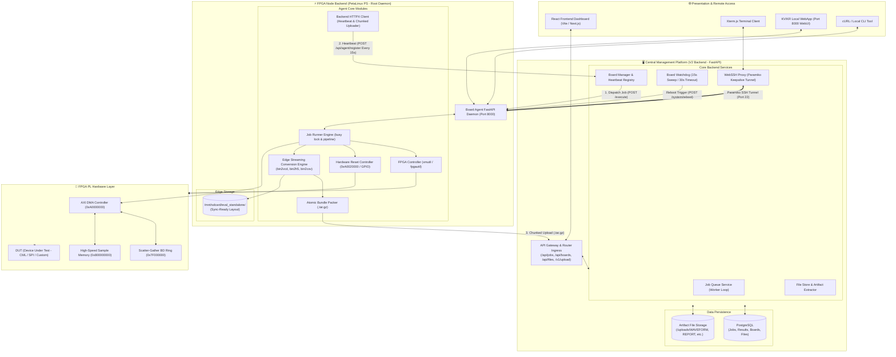
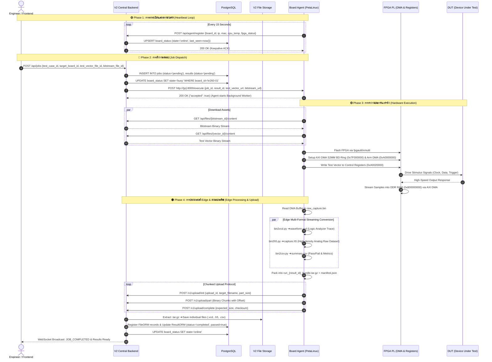
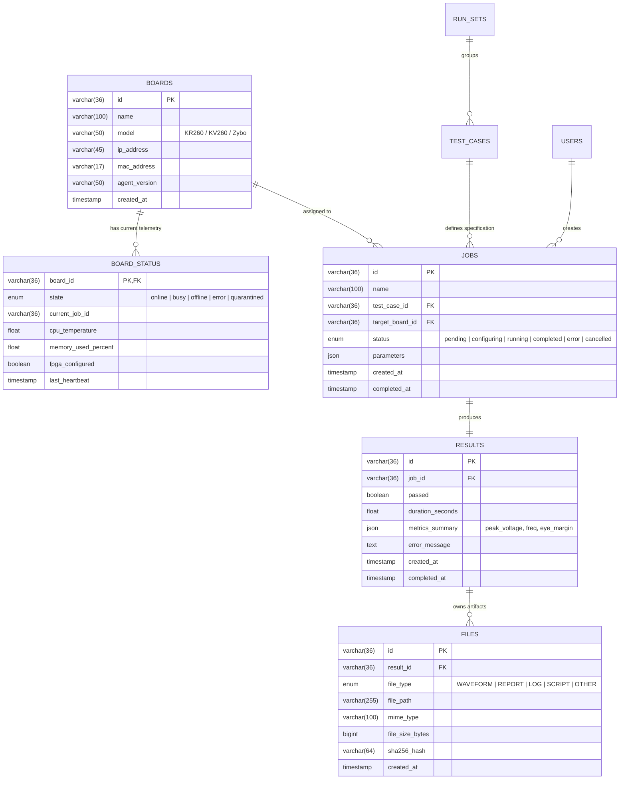
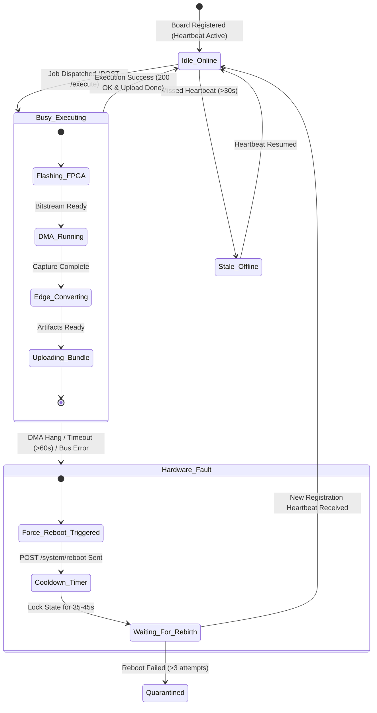

# เอกสารสถาปัตยกรรมระบบหลังบ้าน (Full Backend System Architecture)

## V2 Central Management Platform & FPGA Interface Node

**วันที่จัดทำ:** 26 สิงหาคม 2026
**เวอร์ชัน:** 2.0 (Production Architecture)
**ขอบเขต:** สถาปัตยกรรม Backend ทั้งหมดของระบบ (Central Server + Edge FPGA Agent)

---

## 1. บทนำและวัตถุประสงค์ (Executive Summary)

ระบบ **Automate Evaluation System (Eval System)** เป็นแพลตฟอร์มทดสอบและประเมินผลชิป / ฮาร์ดแวร์แบบอัตโนมัติ (Automated Silicon & Hardware Evaluation Platform) ประกอบด้วย 2 ส่วนประกอบหลักในฝั่ง Backend:

1. **Central Management Server (V2 Backend):** พัฒนาด้วย **FastAPI**, **PostgreSQL**, และ **SQLAlchemy Async** ทำหน้าที่เป็นศูนย์กลางจัดการคิวงาน (Job Dispatcher), จัดการสถานะบอร์ด (Board Fleet Management), รับและจัดเก็บไฟล์ผลลัพธ์ (Artifact Repository), และให้บริการ WebSSH Proxy สำหรับควบคุมบอร์ดทางไกล
2. **FPGA Edge Interface (Board Agent Daemon):** พัฒนาด้วย **FastAPI Daemon (Root Privilege)** บนระบบปฏิบัติการ **PetaLinux (Linux PS)** เชื่อมต่อกับวงจร **FPGA PL** ควบคุม AXI DMA Scatter-Gather Ring Buffer, สั่ง Flash Bitstream, ยิงชุดคำสั่ง Test Vectors ไปยัง DUT (Device Under Test), ประมวลผลแปลงผลลัพธ์ที่ Edge (`.vcd`, `.h5`, `.csv`), และรองรับ **Standalone Mode** ทำงานได้โดยไม่ต้องต่อเน็ต

---

## 2. แผนผังสถาปัตยกรรม Backend รวมทั้งระบบ (Master System Architecture)

---

## 3. แผนผังลำดับการทำงานสมบูรณ์ (End-to-End Execution Sequence Diagram)

---

## 4. โครงสร้างโมเดลฐานข้อมูล (Database Schema & ORM Relationships)

---

## 5. กลยุทธ์การกู้คืนข้อผิดพลาดและการทำงานของ Watchdog (Fault Recovery State Machine)

---

## 6. สเปกรายละเอียด API สำคัญ (Key Backend API Specifications)

### 6.1 V2 Central Platform Endpoints

| Endpoint                       | Method | Role                                             | Request / Response Schema                                                 |
| :------------------------------- | :------: | :------------------------------------------------- | :-------------------------------------------------------------------------- |
| `/api/agent/register`          | `POST` | รับ Heartbeat จากบอร์ด Agent          | `{"board_id": str, "mac": str, "ip": str, "metrics": {...}}` ➔ `200 OK`  |
| `/api/jobs`                    | `POST` | สร้างงานทดสอบใหม่เข้าคิว | `{"test_case_id": str, "board_id": str, "params": {}}` ➔ `201 Created`   |
| `/v1/upload/init`              | `POST` | เริ่มต้น Chunked Upload Session          | `{"upload_id": str, "part_size_bytes": int, "filename": str}` ➔ `200 OK` |
| `/v1/upload/part`              | `POST` | ส่งข้อมูลก้อน Binary (.tar.gz part) | Binary Payload with Query`upload_id` & `part_number`                      |
| `/v1/upload/complete`          | `POST` | ปิด Upload, แตกไฟล์ & ผูก DB        | `{"expected_size": int, "expected_parts": int}` ➔ `200 OK`               |
| `/api/boards/{id}/terminal/ws` |  `WS`  | WebSSH WebSocket Proxy                           | Paramiko SSH Tunnel to Board Port 22                                      |

### 6.2 FPGA Board Agent Endpoints (Port 8000)

| Endpoint         | Method | Role                                                     | รายละเอียด                                                                       |
| :----------------- | :------: | :--------------------------------------------------------- | :------------------------------------------------------------------------------------------- |
| `/health`        | `GET` | Health check & Telemetry                                 | คืนค่า CPU temp, RAM usage, fpga_status, busy flag                                   |
| `/execute`       | `POST` | สั่งเริ่มรันงานทดสอบ                 | รองรับทั้งโหมด V2 (`bitstream_url`) และ Standalone (`test_vector_path`)   |
| `/system/reboot` | `POST` | สั่งรีบูตระบบปฏิบัติการ PetaLinux | รันคำสั่ง`sudo reboot` ภายใต้สิทธิ์ Root ทันที                   |
| `/` (WebUI)      | `GET` | Local WebApp Dashboard                                   | หน้าเว็บ Standalone สำหรับควบคุมและดูสถานะหน้าบอร์ด |

---

## 7. ข้อมูลทางเทคนิคฮาร์ดแวร์ (Hardware Physical Memory Map)

| ช่วงแอดเดรส (Physical Address) | ขนาด (Size) | วัตถุประสงค์ (Purpose)                                                   |
| :------------------------------------------ | :---------------: | :------------------------------------------------------------------------------------- |
| `0xA0000000 - 0xA000FFFF`                 |      64 KB      | **AXI DMA Engine Registers** (MM2S & S2MM Control, Status, BD Pointers)              |
| `0xA0020000 - 0xA002003F`                 |      64 B      | **Custom Control & Reset Registers** (DUT Stimulus Trigger, Reset Pin, Clocks)       |
| `0x7F000000 - 0x7FFFFFFF`                 |      16 MB      | **Scatter-Gather Buffer Descriptor (BD) Ring** ใน DDR RAM                          |
| `0x800000000 - 0x87FFFFFFF`               |      2 GB      | **High-Speed Sample Capture Buffer** (จองไว้รับข้อมูลจาก S2MM DMA) |
