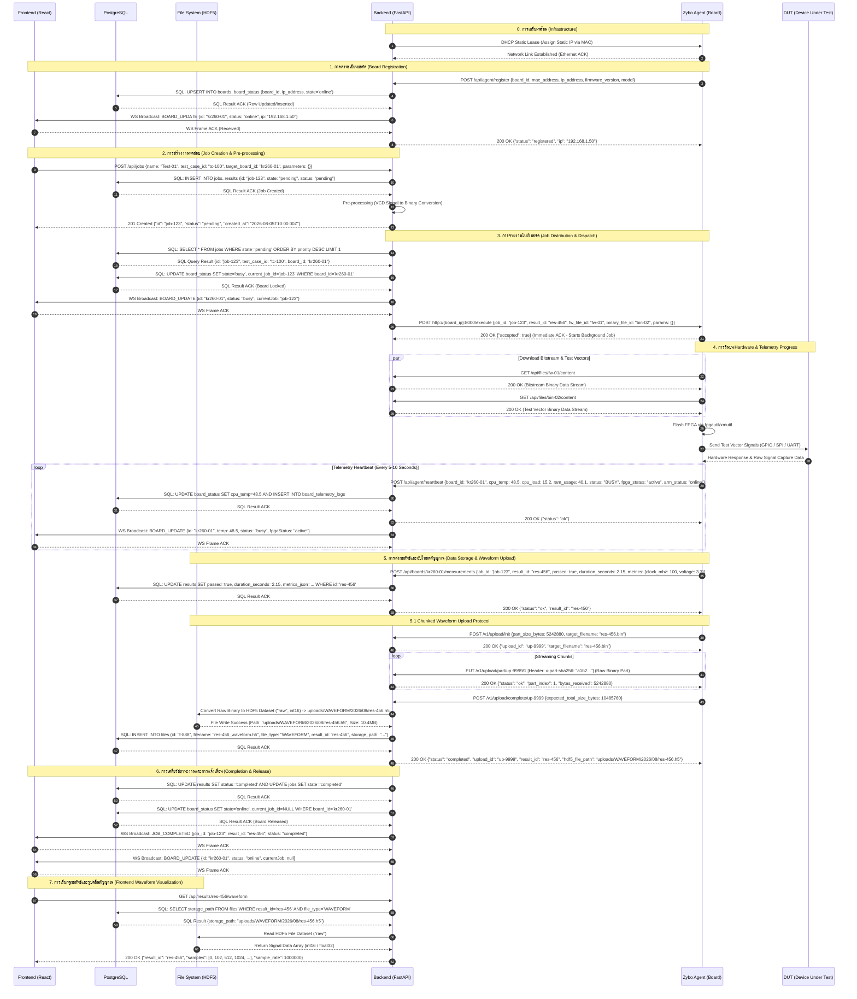

# เอกสารกระบวนการทำงานระดับฮาร์ดแวร์ (Comprehensive Hardware Workflow)
**วันที่อัปเดต:** 5 สิงหาคม 2026 | **สถานะ:** เอกสารอ้างอิงหลัก (Master Reference)

[กลับสู่หน้าหลักสถาปัตยกรรมระบบ (System Architecture & Data Mapping)](./FE_MENU_API_DB_MAPPING.md)

---

## 1. แผนผังลำดับเหตุการณ์ (System Sequence Diagram)
*แผนผังแสดงการโต้ตอบ โครงสร้างข้อมูล Request Payload และ Response Payload ของทุกๆ Interaction ระหว่าง Frontend, Backend, Database, File System, Zybo Agent และ DUT*

---

## 2. การลงทะเบียนบอร์ด (Board Registration)
เมื่อบอร์ด Zybo/KR260 บูตระบบขึ้นมา Agent จะทำการรายงานตัวเพื่อเข้าสู่ระบบ:
*   **IP Assignment:** ระบบใช้ **Static DHCP Lease** (ผ่าน `dnsmasq` หรือ Router) เพื่อจ่าย IP เดิมให้บอร์ดตาม MAC Address
*   **Registration Request (`AG -> BE`):**  
    * **Endpoint:** `POST /api/agent/register`
    * **Request Payload:** `{"board_id": "kr260-01", "name": "KR260 Board #1", "mac_address": "00:0a:35:00:11:22", "ip_address": "192.168.1.50", "firmware_version": "v1.2.0", "model": "KR260", "tag": "bench-1"}`
    * **Response ACK (`BE -> AG`):** `{"status": "registered", "ip": "192.168.1.50"}` (HTTP 200 OK)
*   **Database Interactions (`BE -> DB`):**  
    * **SQL Request:** `INSERT INTO boards ... ON CONFLICT (id) DO UPDATE SET ip_address='192.168.1.50' ...; UPSERT INTO board_status ...`
    * **SQL Response:** `CommandComplete: UPSERT 1`
*   **WebSocket Broadcast (`BE -> FE`):**  
    * **Event Message:** `{"type": "BOARD_UPDATE", "data": {"id": "kr260-01", "name": "KR260 Board #1", "status": "online", "ip": "192.168.1.50"}}`

---

## 3. การจ่ายงาน (Job Distribution & Dispatch)
Backend ใช้ **JobQueueService** และ **PendingJobDispatcher** ในการบริหารจัดการคิวงาน:
*   **Job Creation Request (`FE -> BE`):**  
    * **Endpoint:** `POST /api/jobs`
    * **Request Payload:** `{"name": "Duty Cycle Test", "test_case_id": "tc-101", "target_board_id": "kr260-01", "parameters": {"clock_freq": 10000000}}`
    * **Response ACK (`BE -> FE`):** `{"id": "job-12345", "name": "Duty Cycle Test", "status": "pending", "created_at": "2026-08-05T10:00:00Z"}` (HTTP 201 Created)
*   **Queue Query & Locking (`BE -> DB`):**  
    * **SQL Request:** `SELECT * FROM jobs WHERE state='pending' ORDER BY priority DESC LIMIT 1; UPDATE board_status SET state='busy', current_job_id='job-12345' WHERE board_id='kr260-01'`
    * **SQL Response:** `UPDATE 1` (Board successfully locked)
*   **Dispatch Request (`BE -> AG`):**  
    * **Endpoint:** `POST http://192.168.1.50:8000/execute`
    * **Request Payload:** `{"job_id": "job-12345", "result_id": "res-67890", "fw_file_id": "file-fw-01", "binary_file_id": "file-bin-02", "params": {"clock_freq": 10000000}}`
    * **Response ACK (Immediate `AG -> BE`):** `{"accepted": true}` (HTTP 200/202 ตอบกลับทันทีว่าเริ่มงานใน Background แล้ว)

---

## 4. กลไกการโอนไฟล์และการรันบน Hardware (File Transfer & Execution)
เพื่อให้บอร์ดทำงานได้แม้ Network ไม่เสถียร ระบบจึงใช้การ **Download & Local Run**:
1.  **Asset Download (`AG -> BE`):**  
    * **Endpoint:** `GET /api/files/file-fw-01/content` และ `GET /api/files/file-bin-02/content`
    * **Response Stream (`BE -> AG`):** ส่ง Binary Stream ของไฟล์ Bitstream และ Test Vector (HTTP 200 OK)
2.  **Hardware Flashing & DUT Signals (`AG -> DUT`):**  
    * **Agent Execution:** Agent รัน `fpgautil -b /tmp/firmware.bit` เพื่อ Flash FPGA  
    * **DUT Request Signal:** Agent ปล่อยสัญญาณ Test Vector ออกทาง GPIO / SPI / UART ไปที่ DUT  
    * **DUT Response Signal:** DUT ตอบสนองกลับเป็นสัญญาณทางไฟฟ้า $\rightarrow$ Agent ทำการ Capture เก็บลง Memory Buffer ดิบบนบอร์ด
3.  **Telemetry Heartbeat (`AG -> BE`):**  
    * **Endpoint:** `POST /api/agent/heartbeat`
    * **Request Payload:** `{"board_id": "kr260-01", "cpu_temp": 48.5, "cpu_load": 12.3, "ram_usage": 35.1, "status": "BUSY", "fpga_status": "active", "arm_status": "online"}`
    * **Response ACK (`BE -> AG`):** `{"status": "ok"}` (HTTP 200 OK)
    * **DB Log (`BE -> DB`):** `INSERT INTO board_telemetry_logs (board_id, cpu_temp, cpu_load, ram_usage, recorded_at) VALUES (...)`

---

## 5. การจัดเก็บข้อมูลทดสอบและรายงานผล (Data Upload & Measurement)
ข้อมูลผลลัพธ์จะถูกส่งกลับมาเก็บใน 2 รูปแบบ:

### 5.1 Metadata & Measurement Reporting (`AG -> BE`)
* **Endpoint:** `POST /api/boards/kr260-01/measurements`
* **Request Payload:** `{"job_id": "job-12345", "result_id": "res-67890", "passed": true, "duration_seconds": 2.45, "error_message": null, "metrics": {"voltage_v": 3.3, "clock_mhz": 100}}`
* **Response ACK (`BE -> AG`):** `{"status": "ok", "result_id": "res-67890"}` (HTTP 200 OK)
* **DB Update (`BE -> DB`):** `UPDATE results SET status='completed', passed=true, duration_seconds=2.45, metrics_json='...' WHERE id='res-67890'`

### 5.2 Chunked Waveform Upload Protocol (`AG -> BE -> FS -> DB`)
1.  **Init Upload:** `POST /v1/upload/init`
    * **Request Payload:** `{"part_size_bytes": 5242880, "target_filename": "res-67890.bin"}`
    * **Response ACK:** `{"upload_id": "up-uuid-1234", "target_filename": "res-67890.bin"}`
2.  **Upload Parts:** `PUT /v1/upload/part/up-uuid-1234/{part_index}`
    * **Request Header:** `x-part-sha256: e3b0c44298fc1c149afbf4c8996fb92427ae41e4649b934ca495991b7852b855`
    * **Request Body:** Binary Raw Signal Chunk Data
    * **Response ACK:** `{"status": "ok", "part_index": 1, "bytes_received": 5242880}`
3.  **Complete Upload & HDF5 Conversion:** `POST /v1/upload/complete/up-uuid-1234`
    * **Request Payload:** `{"expected_total_size_bytes": 10485760}`
    * **FS Action (`BE -> FS`):** แปลงไฟล์ Binary ดิบบน Temp Disk ให้เป็นไฟล์ **HDF5 (`.h5`)** ในโครงสร้าง `/uploads/WAVEFORM/2026/08/res-67890.h5` Dataset `"raw"`
    * **FS Response (`FS -> BE`):** เขียนไฟล์เสร็จสิ้น (File Write Success)
    * **DB Action (`BE -> DB`):** `INSERT INTO files (id, filename, file_type, storage_path, result_id) VALUES ('f-999', 'res-67890_waveform.h5', 'WAVEFORM', 'uploads/WAVEFORM/2026/08/res-67890.h5', 'res-67890')`
    * **Response ACK (`BE -> AG`):** `{"status": "completed", "upload_id": "up-uuid-1234", "result_id": "res-67890", "sha256": "...", "hdf5_file_path": "uploads/WAVEFORM/2026/08/res-67890.h5"}`

---

## 6. สรุปตารางรายละเอียด Request Payload และ Response ทั้งหมดในระบบ (Complete System API Reference Table)

### หมวดที่ 1: การประมวลผลงานทดสอบและไฟล์สัญญาณ (Job Execution & Waveform Pipeline)

| ลำดับ | การสื่อสาร (Sender $\rightarrow$ Receiver) | API Endpoint / Channel / Operation | Structure ของ Request Payload / SQL Query | Structure ของ Response Payload / Return Value |
| :---: | :--- | :--- | :--- | :--- |
| **1** | Agent $\rightarrow$ Backend | `POST /api/agent/register` | `{"board_id": str, "mac_address": str, "ip_address": str, "firmware_version": str, "model": str}` | `{"status": "registered", "ip": str}` (HTTP 200 OK) |
| **2** | Backend $\rightarrow$ DB | `SQL: UPSERT Board` | `UPSERT INTO boards, board_status VALUES (...)` | `CommandComplete: UPSERT 1` |
| **3** | Frontend $\rightarrow$ Backend | `POST /api/jobs` | `{"name": str, "test_case_id": str, "target_board_id": str, "parameters": dict}` | `{"id": str, "name": str, "status": "pending", "created_at": str}` (HTTP 201) |
| **4** | Backend $\rightarrow$ DB | `SQL: INSERT Job & Result` | `INSERT INTO jobs (...); INSERT INTO results (...)` | `CommandComplete: INSERT 0 1` |
| **5** | Backend $\rightarrow$ DB | `SQL: SELECT Pending Job` | `SELECT * FROM jobs WHERE state='pending' ORDER BY priority DESC LIMIT 1` | Row Data `{id: "job-123", test_case_id: "tc-100", board_id: "kr260-01"}` |
| **6** | Backend $\rightarrow$ DB | `SQL: Lock Board Status` | `UPDATE board_status SET state='busy', current_job_id='job-123' WHERE board_id='...'` | `CommandComplete: UPDATE 1` |
| **7** | Backend $\rightarrow$ Agent | `POST http://{ip}:8000/execute` | `{"job_id": str, "result_id": str, "fw_file_id": str, "binary_file_id": str, "params": dict}` | `{"accepted": true/false}` (HTTP 200/202 OK) |
| **8** | Agent $\rightarrow$ Backend | `GET /api/files/{id}/content` | Request Params: `file_id` | `Binary Data Stream` (Content-Type: application/octet-stream) |
| **9** | Agent $\rightarrow$ DUT | `Hardware Signal Vector` | Physical Signals (GPIO / SPI / UART Pulse Vectors) | Physical Response Signal Waves |
| **10**| Agent $\rightarrow$ Backend | `POST /api/boards/{id}/measurements` | `{"job_id": str, "result_id": str, "passed": bool, "duration_seconds": float, "metrics": dict}` | `{"status": "ok", "result_id": str}` (HTTP 200 OK) |
| **11**| Agent $\rightarrow$ Backend | `POST /v1/upload/init` | `{"part_size_bytes": int, "target_filename": str}` | `{"upload_id": str, "target_filename": str}` (HTTP 200 OK) |
| **12**| Agent $\rightarrow$ Backend | `PUT /v1/upload/part/{upload_id}/{idx}` | Body: `Binary Chunk Payload`   Header: `x-part-sha256: Hash` | `{"status": "ok", "part_index": int, "bytes_received": int}` (HTTP 200 OK) |
| **13**| Agent $\rightarrow$ Backend | `POST /v1/upload/complete/{upload_id}`| `{"expected_total_size_bytes": int}` | `{"status": "completed", "result_id": str, "hdf5_file_path": str}` |
| **14**| Backend $\rightarrow$ File System| `HDF5 Conversion I/O` | Write Binary Stream to HDF5 Dataset (`/raw`, dtype=`<i2`) | Success (`storage_path`: `"uploads/WAVEFORM/.../res-xxx.h5"`) |
| **15**| Backend $\rightarrow$ DB | `SQL: Insert Waveform File` | `INSERT INTO files (id, file_type, storage_path, result_id) VALUES (...)` | `CommandComplete: INSERT 0 1` |
| **16**| Backend $\rightarrow$ DB | `SQL: Mark Job Completed` | `UPDATE results SET status='completed'; UPDATE jobs SET state='completed'` | `CommandComplete: UPDATE 1` |
| **17**| Backend $\rightarrow$ DB | `SQL: Release Board` | `UPDATE board_status SET state='online', current_job_id=NULL WHERE board_id='...'` | `CommandComplete: UPDATE 1` |

### หมวดที่ 2: การติดตามสถานะบอร์ดและ Telemetry (Board Status & Telemetry APIs)

| ลำดับ | การสื่อสาร (Sender $\rightarrow$ Receiver) | API Endpoint / Channel / Operation | Structure ของ Request Payload / SQL Query | Structure ของ Response Payload / Return Value |
| :---: | :--- | :--- | :--- | :--- |
| **18**| Agent $\rightarrow$ Backend | `POST /api/agent/heartbeat` | `{"board_id": str, "cpu_temp": float, "cpu_load": float, "ram_usage": float, "status": str, "fpga_status": str, "arm_status": str}` | `{"status": "ok"}` (HTTP 200 OK) |
| **19**| Backend $\rightarrow$ DB | `SQL: Log Telemetry` | `UPDATE board_status ...; INSERT INTO board_telemetry_logs (...)` | `CommandComplete: INSERT 0 1` |
| **20**| Backend $\rightarrow$ Frontend | `WebSocket: BOARD_UPDATE` | Broadcast Event Message | `{"type": "BOARD_UPDATE", "data": {"id": str, "status": str, "temp": float, "currentJob": str}}` |
| **21**| Frontend $\rightarrow$ Backend | `GET /api/boards/{id}/telemetry` | Path Param: `board_id` | `[{"recorded_at": str, "cpu_temp": float, "cpu_load": float, "ram_usage": float}]` (HTTP 200) |
| **22**| Backend Watchdog $\rightarrow$ DB | `SQL: Sweep Stale Boards` | `UPDATE board_status SET state='offline' WHERE last_heartbeat < NOW() - INTERVAL '30s'` | `CommandComplete: UPDATE N` |

### หมวดที่ 3: การควบคุมบอร์ดและการเชื่อมต่อ WebSSH (Board Control & WebSSH APIs)

| ลำดับ | การสื่อสาร (Sender $\rightarrow$ Receiver) | API Endpoint / Channel / Operation | Structure ของ Request Payload / SQL Query | Structure ของ Response Payload / Return Value |
| :---: | :--- | :--- | :--- | :--- |
| **23**| Frontend $\rightarrow$ Backend | `POST /api/boards/{id}/reboot` | Path Param: `board_id` | `{"success": true, "message": "Board reboot initiated"}` (HTTP 200) |
| **24**| Backend $\rightarrow$ Agent | `POST http://{ip}:8000/system/reboot` | Empty Request Body | `{"status": "rebooting"}` (HTTP 200 OK) |
| **25**| Frontend $\rightarrow$ Backend | `POST /api/boards/{id}/ping` | Path Param: `board_id` | `{"board_id": str, "reachable": bool}` (HTTP 200 OK) |
| **26**| Backend $\rightarrow$ Agent | `GET http://{ip}:8000/health` | Empty Query | `{"status": "ok"}` (HTTP 200 OK) |
| **27**| Frontend $\rightarrow$ Backend | `POST /api/boards/batch` | `{"boardIds": [str], "action": "reboot" \| "updateFirmware" \| "selfTest" \| "delete"}` | `{"success": true, "results": [{"boardId": str, "success": bool}]}` (HTTP 200) |
| **28**| Frontend $\leftrightarrow$ Backend | `WS /api/boards/{id}/ssh/connect` | Interactive xterm.js Terminal WebSocket Connection | Bidirectional UTF-8 Terminal Stream & Keepalives |
| **29**| Backend $\leftrightarrow$ Agent | `SSH Protocol (Port 22)` | Paramiko SSH Tunnel Session (`username`, `password`) | Interactive PTY Shell Data & Channel Output |

### หมวดที่ 4: การจัดการงานและผลลัพธ์ (Jobs & Waveform Results APIs)

| ลำดับ | การสื่อสาร (Sender $\rightarrow$ Receiver) | API Endpoint / Channel / Operation | Structure ของ Request Payload / SQL Query | Structure ของ Response Payload / Return Value |
| :---: | :--- | :--- | :--- | :--- |
| **30**| Frontend $\rightarrow$ Backend | `GET /api/boards` | Query Params: `status`, `model`, `firmware` | `[{"id": str, "name": str, "status": str, "ip": str, "temp": float, ...}]` (HTTP 200 OK) |
| **31**| Frontend $\rightarrow$ Backend | `GET /api/jobs` | Query Params: `status`, `board_id`, `limit` | `[{"id": str, "name": str, "status": str, "created_at": str}]` (HTTP 200 OK) |
| **32**| Frontend $\rightarrow$ Backend | `POST /api/jobs/{id}/re-run` | Path Param: `job_id` | `{"status": "re_queued", "new_job_id": str}` (HTTP 200 OK) |
| **33**| Frontend $\rightarrow$ Backend | `DELETE /api/jobs/{id}` | Path Param: `job_id` | `{"status": "cancelled", "job_id": str}` (HTTP 200 OK) |
| **34**| Frontend $\rightarrow$ Backend | `GET /api/results/{id}/waveform` | Path Param: `result_id` | `{"result_id": str, "samples": [...], "sample_rate": int}` (HTTP 200 OK) |
| **35**| Backend $\rightarrow$ File System| `HDF5 Read I/O` | Read Dataset `"raw"` from `uploads/WAVEFORM/YYYY/MM/{result_id}.h5` | Return `NumPy Array` Data |
| **36**| Frontend $\rightarrow$ Backend | `POST /api/files/upload` | Form-Data File Upload (`firmware`/`vcd`/`script`) | `{"file_id": str, "filename": str, "file_type": str, "size_bytes": int}` (HTTP 201) |

---

## 7. ข้อเสนอแนะเพื่อเพิ่มความรัดกุมของ API และการรองรับโหมด Standalone (API Robustness & Architectural Alignment)

จากการวิเคราะห์สถาปัตยกรรมร่วมกัน ระบบได้สรุปแนวทางการปรับปรุง API เพื่อความรัดกุมและเสถียรภาพสูงสุด 4 ประการ ดังนี้:

### 7.1 IP-Based Trust Model & Standalone Direct LAN Mode
* **รูปแบบการยืนยันตัวตน:** คงการใช้ **IP-Based Trust** เพื่อรองรับความสะดวกในการใช้งานทั้งในแบบ Fleet (ผ่าน Switch/Router) และแบบ **Standalone (ต่อสาย LAN ตรงระหว่าง PC กับบอร์ด FPGA)** โดยไม่ต้องยุ่งยากกับการจัดการ API Tokens หรือ Certificates
* **mDNS Hostname Discovery:** บอร์ด Agent รองรับการระบุ `backend_url` แบบ Dynamic ผ่าน mDNS (เช่น `http://eval-backend.local:8000`) และระบบ Auto-retry registration เมื่อมีการถอด/เสียบสาย LAN หรือเปลี่ยน IP

### 7.2 Chunked Upload Session Resume & TTL Cleanup
* **Upload Progress Query (`GET /v1/upload/status/{upload_id}`):** เพิ่ม Endpoint ให้ Agent สามารถยิงสอบถาม Backend เพื่อตรวจสอบว่า Part ใดบ้างที่ได้รับเรียบร้อยแล้ว หากเครือข่ายกระตุก Agent สามารถส่งซ้ำเฉพาะ Part ที่หลุดได้ทันทีโดยไม่ต้องเริ่มนับหนึ่งใหม่
* **Session TTL Auto-Cleanup:** กำหนดอายุ Upload Session หากไม่มีการส่ง Chunk ใหม่เข้ามาภายใน 10 นาที Backend จะปิดไฟล์ Handle และลบไฟล์ชั่วคราว `.part` ทิ้งอัตโนมัติเพื่อป้องกัน Memory Leak

### 7.3 Dynamic Job Execution Timeout & Error Recovery
* **VCD-Based / Configurable Execution Timeout:** กำหนดเวลาทำงานสูงสุดของแต่ละ Job แบบ Dynamic โดยคำนวณจากความยาว/ขนาดของไฟล์ VCD (หรือระบุผ่านค่า `timeout_seconds` ใน Job Parameters) หากการ Flash FPGA หรือการจับสัญญาณใช้เวลานานเกินกำหนด Backend จะเปลี่ยนสถานะ Job เป็น `error` / `timeout` อัตโนมัติ
* **Manual Reset Control (เอา Auto-Reset ออก):** ยกเลิกการสั่ง Reboot บอร์ดอัตโนมัติเมื่อเกิด Timeout เพื่อป้องกันการสั่ง Reboot ฮาร์ดแวร์โดยไม่ตั้งใจระหว่างการ Debug งาน โดยให้บอร์ดคงสถานะไว้และให้ผู้ใช้เป็นผู้พิจารณาสั่ง Reboot ผ่านหน้าเว็บ หรือสั่ง Re-run ด้วยตนเอง

---

[กลับสู่หน้าหลักสถาปัตยกรรมระบบ (System Architecture & Data Mapping)](./FE_MENU_API_DB_MAPPING.md)

