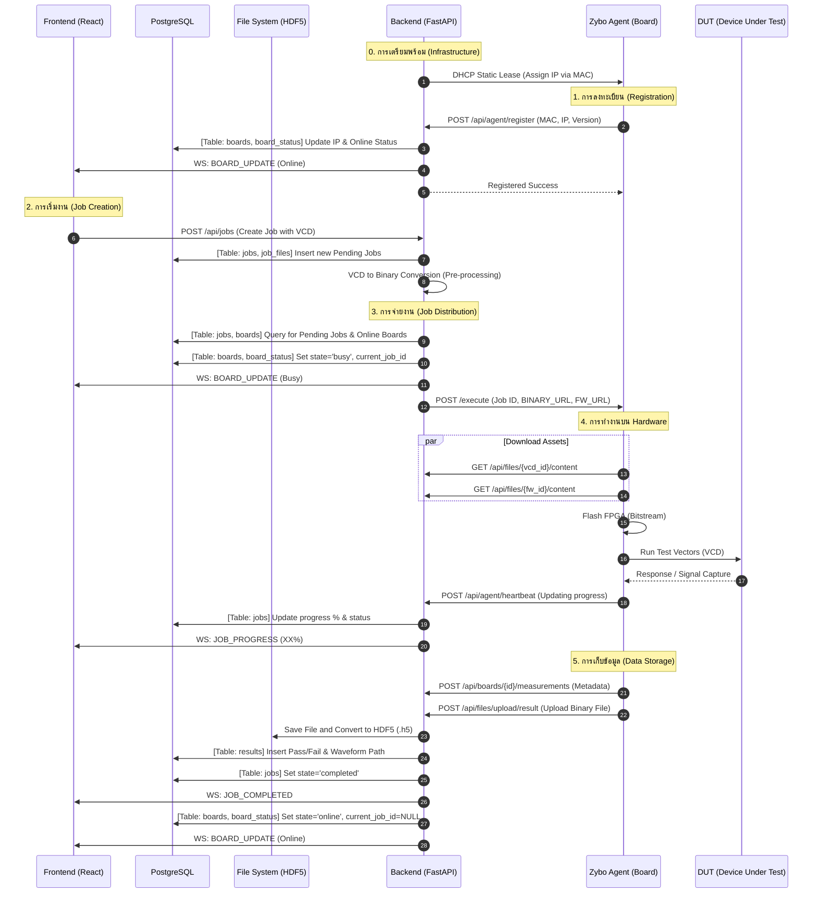

# เอกสารกระบวนการทำงานระดับฮาร์ดแวร์ (Comprehensive Hardware Workflow)
**วันที่อัปเดต:** 12 พฤษภาคม 2026 | **สถานะ:** เอกสารอ้างอิงหลัก (Master Reference)

[กลับสู่หน้าหลักสถาปัตยกรรมระบบ (System Architecture & Data Mapping)](./FE_MENU_API_DB_MAPPING.md)

---

## 1. แผนผังลำดับเหตุการณ์ (System Sequence Diagram)
*แผนผังแสดงการโต้ตอบระหว่าง Frontend, Backend, Database และ Zybo Agent*

---

## 2. การลงทะเบียนบอร์ด (Board Registration)
เมื่อบอร์ด Zybo บูตระบบขึ้นมา Agent จะทำการรายงานตัวเพื่อเข้าสู่ระบบ:
*   **IP Assignment:** ระบบใช้ **Static DHCP Lease** (ผ่าน `dnsmasq`) เพื่อจ่าย IP เดิมให้บอร์ดตาม MAC Address
*   **Registration:** Agent ส่งข้อมูล MAC/IP ไปที่ `POST /api/agent/register`
*   **Tables:** ข้อมูลจะถูกบันทึกลงใน `boards` (ข้อมูลพื้นฐาน) และ `board_status` (สถานะ Real-time)

## 3. การจ่ายงาน (Job Distribution & Dispatch)
Backend ใช้ **JobQueueService** ในการบริหารจัดการคิวงาน:
*   **Queue Source:** ดึงงานจากตาราง `jobs` ที่มีสถานะ `pending` ตามลำดับความสำคัญ (Priority)
*   **Board Locking:** เมื่อพบงานและบอร์ดที่ว่าง ระบบจะทำการ "Lock" บอร์ดโดยเปลี่ยนสถานะเป็น `busy` ทันทีเพื่อป้องกันการชนกันของงาน
*   **Dispatch:** Backend ส่งคำสั่งรันงานไปที่ Agent ผ่าน API `/execute` พร้อมแนบ **Download URLs** สำหรับไฟล์ VCD และ Firmware

## 4. กลไกการโอนไฟล์ (File Transfer Mechanism)
เพื่อให้บอร์ดทำงานได้แม้ Network ไม่เสถียร ระบบจึงใช้การ **Download & Local Run**:
1.  Backend เตรียมไฟล์และแจ้ง URL ให้ Agent
2.  Agent ใช้ HTTP GET เพื่อดาวน์โหลดไฟล์มาเก็บไว้ใน **RAM Disk/Local Storage** บนบอร์ด Zybo
3.  Agent ทำการ Flash FPGA และรันการทดสอบจากไฟล์ในตัวบอร์ดเอง (ลด Latency ของ Network)
4.  เมื่อจบงาน Agent จะลบไฟล์ชั่วคราวทิ้งเพื่อคืนพื้นที่

## 5. การจัดเก็บข้อมูลทดสอบ (Hybrid Storage)
ข้อมูลผลลัพธ์จะถูกส่งกลับมาเก็บใน 2 รูปแบบ:
*   **Metadata:** ผลการทดสอบ (Pass/Fail) และค่าสถิติต่างๆ บันทึกลงตาราง `results`
*   **Waveform:** ไฟล์สัญญาณดิบจะถูกอัปโหลดกลับมายัง Backend เพื่อแปลงเป็น **HDF5 (.h5)** ซึ่งช่วยให้ประหยัดพื้นที่และสามารถเรียกดูข้อมูล (Visualize) ได้รวดเร็ว

---

[กลับสู่หน้าหลักสถาปัตยกรรมระบบ (System Architecture & Data Mapping)](./FE_MENU_API_DB_MAPPING.md)
