# แผนปรับปรุงสถาปัตยกรรมฐานข้อมูล (Proposed Database Redesign - Enterprise Grade)
**สถานะ:** ข้อเสนอฉบับสมบูรณ์ | **วันที่อัปเดต:** 13 พฤษภาคม 2026 (rev 2 — Multi-Board Job Targets)

เอกสารฉบับนี้เป็น **Source of Truth** สำหรับการออกแบบฐานข้อมูลใหม่ มุ่งเน้นไปที่ความถูกต้องของข้อมูล (Data Integrity), การรองรับข้อผิดพลาดระดับฮาร์ดแวร์ (Fault Tolerance), และการแยกส่วนประกอบที่ชัดเจน (Separation of Concerns)

> **⚠️ Naming Convention:** 
> ฐานข้อมูลทั้งหมดจะใช้มาตรฐาน **`snake_case`** (เช่น `vcd_file_id`, `created_at`) 
> ส่วนการแปลงเป็น `camelCase` (เช่น `vcdFileId`) เพื่อคุยกับ Frontend จะเป็นหน้าที่ของ Pydantic Models ใน API Layer เพื่อไม่ให้เกิดการปะปนของ Naming Convention ในระดับ Schema

---

## 1. แผนผังความสัมพันธ์ (Complete ER Diagram)

```mermaid
erDiagram
    %% ── Profiles (Identity) ────────────────────────────
    profiles ||--o{ notifications : "receives"
    profiles ||--o{ files         : "owns"
    profiles ||--o{ test_cases    : "owns"
    profiles ||--o{ test_suites    : "owns"
    profiles ||--o{ jobs          : "created by"

    %% ── Hardware ──────────────────────────────────────
    boards ||--|| board_status         : "has current telemetry"
    boards ||--o{ board_telemetry_log  : "historical telemetry"

    %% ── Unified Tagging ───────────────────────────────
    tags ||--o{ tags_map          : "defines"
    tags_map }o--|| files         : "tags FILE"
    tags_map }o--|| test_cases    : "tags TEST_CASE"
    tags_map }o--|| test_suites    : "tags TEST_SUITE"
    tags_map }o--|| jobs          : "tags JOB"
    tags_map }o--|| results       : "tags RESULT"
    tags_map }o--|| boards        : "tags BOARD"

    %% ── File Library ──────────────────────────────────
    test_cases }o--|| files : "uses vcd_file_id"
    test_cases }o--|| files : "uses bin_file_id"
    test_cases }o--|| files : "uses lin_file_id"
    test_cases }o--|| files : "uses mdi_file_id"

    %% ── Test Definitions ──────────────────────────────
    test_suites     ||--o{ test_suite_items : "contains"
    test_suite_items }o--|| test_cases    : "links"

    %% ── Execution ─────────────────────────────────────
    jobs        ||--o{ job_targets : "targets boards via"
    boards      ||--o{ job_targets : "requested or actual board"
    job_targets ||--o{ job_items   : "executes"
    job_items   }o--|| test_cases  : "instance of"
    job_items   ||--o| results     : "produces"

    %% ── Result Files ──────────────────────────────────
    results ||--o{ result_files : "has output files"

    %% ══════════════════════════════════════════════════
    %% TABLE DEFINITIONS
    %% ══════════════════════════════════════════════════

    profiles {
        uuid         id          PK  "Share Key — Profile identifier"
        varchar(255) name            "Display name shown in UI"
        datetime     created_at      "Profile creation timestamp"
        datetime     updated_at      "Last preference update timestamp"
    }

    notifications {
        uuid         id          PK  "Notification identifier"
        uuid         profile_id  FK  "→ profiles.id (NULL = broadcast to all)"
        enum         type            "JOB_DONE | JOB_ERROR | SYSTEM"
        varchar(255) title           "Short subject line"
        text         message         "Full notification body"
        boolean      is_read         "Read flag (default false)"
        jsonb        data            "Extra payload e.g. jobId for frontend routing"
        datetime     created_at      "Sent timestamp"
    }

    boards {
        varchar(17)  id               PK  "MAC address as permanent unique ID (format: AA:BB:CC:DD:EE:FF)"
        varchar(255) name                 "Human-readable alias e.g. Zybo-01"
        varchar(64)  ip_address           "Last known IP from heartbeat"
        varchar(128) model                "Hardware model e.g. Zybo Z7-20"
        varchar(128) firmware_version     "Agent firmware version"
        jsonb        connections          "Array of supported protocol strings e.g. [REST API, SSH]"
        datetime     created_at           "Board registration timestamp"
    }

    board_telemetry_log {
        bigint      id          PK    "Auto-increment (high write — skip uuid)"
        varchar(17) board_id    FK    "→ boards.id"
        float       cpu_temp          "CPU temperature in Celsius"
        float       cpu_load          "CPU load percentage 0-100"
        float       ram_usage         "RAM usage percentage 0-100"
        enum        fpga_status       "active | idle | error | unknown"
        enum        arm_status        "online | busy | error | unknown"
        datetime    recorded_at       "Heartbeat timestamp — index for range queries"
    }

    board_status {
        varchar(17) board_id         PK,FK "→ boards.id (1-to-1)"
        enum        state                  "online | offline | busy | error"
        datetime    last_heartbeat         "Last contact time — used by Watchdog"
        float       cpu_temp               "CPU temperature in Celsius"
        float       cpu_load               "CPU load percentage 0-100"
        float       ram_usage              "RAM usage percentage 0-100"
        enum        fpga_status            "active | idle | error | unknown"
        enum        arm_status             "online | busy | error | unknown"
        datetime    updated_at             "Last telemetry update timestamp"
    }

    files {
        uuid         id           PK  "File identifier"
        varchar(255) filename         "Original uploaded filename"
        enum         file_type        "VCD | EROM | ULP | TXT | SCRIPT | OTHER"
        varchar(512) storage_path     "Absolute server path to file"
        char(64)     checksum         "SHA-256 for dedup and integrity check"
        bigint       size_bytes       "File size in bytes"
        uuid         owner_id     FK  "→ profiles.id (uploader)"
        enum         visibility       "private | public"
        datetime     uploaded_at      "Upload timestamp"
        datetime     updated_at       "Metadata last modified timestamp"
    }

    tags {
        uuid         id          PK  "Tag identifier"
        varchar(100) name            "Tag label (UNIQUE across system)"
        varchar(16)  tag_color       "Color palette key for UI rendering (e.g. sky, violet, indigo)"
        datetime     created_at      "Tag creation timestamp"
    }

    tags_map {
        uuid        tag_id      PK,FK "→ tags.id"
        varchar(64) entity_id   PK    "ID of the tagged record (uuid 36-char for FILE/JOB etc.; MAC 17-char for BOARD)"
        enum        entity_type PK    "FILE | TEST_CASE | TEST_SUITE | JOB | RESULT | BOARD"
        datetime    created_at        "Tagged-at timestamp"
    }

    test_cases {
        uuid         id           PK  "Test case identifier"
        varchar(255) name             "Test case label"
        uuid         vcd_file_id  FK  "→ files.id (VCD stimulus file)"
        uuid         bin_file_id  FK  "→ files.id (EROM firmware binary)"
        uuid         lin_file_id  FK  "→ files.id (ULP logic file)"
        uuid         mdi_file_id  FK  "→ files.id (TXT command file)"
        uuid         owner_id     FK  "→ profiles.id (creator)"
        smallint     try_count        "Retry attempts per execution (default 1)"
        enum         visibility       "private | public"
        datetime     updated_at       "Last modified timestamp"
    }

    test_suites {
        uuid         id          PK  "Suite identifier"
        varchar(255) name            "Suite label"
        uuid         owner_id    FK  "→ profiles.id (creator)"
        enum         visibility      "private | public"
        datetime     updated_at      "Last modified timestamp"
    }

    test_suite_items {
        uuid    id               PK  "Item identifier"
        uuid    suite_id         FK  "→ test_suites.id"
        uuid    test_case_id     FK  "→ test_cases.id"
        integer execution_order      "Run sequence in suite (gap pattern e.g. 10,20,30 — allows reorder without renumber)"
    }

    jobs {
        uuid         id               PK  "Job identifier"
        varchar(255) name                 "Job label"
        enum         status               "pending | running | completed | cancelled | failed"
        uuid         profile_id       FK  "→ profiles.id (requester)"
        varchar(255) config_name          "Named configuration used for this run"
        smallint     progress             "Aggregate progress 0-100% (denormalized from job_items)"
        smallint     priority             "Queue priority — higher value runs first"
        integer      timeout_seconds      "Max execution time per board in seconds (default 60) — integer to support long-running tests > 9h"
        boolean      enable_picoscope     "Record waveform signal via Picoscope (default false)"
        varchar(255) current_step         "Human-readable current execution step"
        text         error_message        "Top-level error summary if job failed"
        datetime     created_at           "Job creation timestamp"
        datetime     started_at           "Timestamp when first target started"
        datetime     completed_at         "Timestamp when last target finished"
    }

    job_targets {
        uuid        id                 PK  "Target identifier"
        uuid        job_id             FK  "→ jobs.id"
        enum        target_type            "specific | any"
        varchar(17) requested_board_id FK  "→ boards.id — board user requested (NULL if type=any)"
        varchar(17) actual_board_id    FK  "→ boards.id — board engine assigned at runtime"
        enum        status                 "pending | running | completed | failed | board_lost | timed_out | retrying | cancelled"
        datetime    board_assigned_at      "Timestamp engine dispatched work to board"
        datetime    board_lost_at          "Timestamp board disconnected mid-run"
        smallint    retry_count            "Number of retry attempts due to board failure"
        enum        retry_reason           "BOARD_LOST | TIMED_OUT | NULL"
        datetime    started_at             "Timestamp first job_item started on this board"
        datetime    completed_at           "Timestamp last job_item finished on this board"
    }

    job_items {
        uuid         id              PK  "Item identifier"
        uuid         job_id          FK  "→ jobs.id (shortcut — avoid 2-level JOIN)"
        uuid         job_target_id   FK  "→ job_targets.id (which board runs this)"
        uuid         test_case_id    FK  "→ test_cases.id (template reference)"
        enum         status              "pending | running | completed | stopped | error"
        integer      execution_order     "Run sequence — frozen at job creation time (gap pattern e.g. 10,20,30)"
        smallint     try_count           "Actual run attempts performed"
        text         error_message       "Execution error detail for this test case"
        datetime     started_at          "Test case execution start timestamp"
        datetime     completed_at        "Test case execution end timestamp"
    }

    results {
        uuid        id            PK  "Result identifier"
        uuid        job_item_id   FK  "→ job_items.id"
        uuid        job_id        FK  "→ jobs.id (shortcut — avoid 2-level JOIN)"
        varchar(17) board_id      FK  "→ boards.id (shortcut — avoid 3-level JOIN)"
        boolean     passed            "Test outcome: true=pass, false=fail"
        float       duration          "Execution duration in seconds"
        datetime    started_at        "Test start timestamp"
        datetime    completed_at      "Test end timestamp"
        jsonb       metrics_json      "Numeric metrics e.g. CRC errors, packet count"
        jsonb       snapshot_data     "Snapshot of filenames, checksums, config at run time"
        datetime    created_at        "Record creation timestamp"
    }

    result_files {
        uuid         id             PK  "File record identifier"
        uuid         result_id      FK  "→ results.id"
        enum         file_type          "LOG | WAVEFORM | REPORT"
        varchar(512) storage_path       "Absolute server path to output file"
        varchar(255) filename           "Display filename for download"
        bigint       size_bytes         "File size in bytes"
        char(64)     checksum           "SHA-256 integrity check"
        datetime     created_at         "File record creation timestamp"
    }
```



---

## 2. นิยาม Ownership และ Visibility (Access Control)
ตารางหลักทั้งหมด (`files`, `test_cases`, `test_suites`) จะต้องระบุ `owner_id` (อ้างอิง `profiles.id`) และมีกฎการมองเห็นดังนี้:
*   **`public`**: Profiles ทุกคนสามารถค้นเจอ, ดูรายละเอียด, และนำไปใช้รันได้ (Read-Only)
*   **`private`**: เฉพาะ `owner_id` ที่สร้างเท่านั้นถึงจะเห็นและใช้งานได้

*(หมายเหตุ: Profiles Data จะทำหน้าที่เก็บแค่ Preferences หรือ Config ของ User ไม่ใช่แหล่งเก็บ Test Case หลักอีกต่อไป)*

---

## 3. Execution Model และ Snapshot Data
โครงสร้างใหม่ยกเลิกการใช้ `job_files` และ `pairs_data` (Frontend Cache) และเปลี่ยนมาใช้โครงสร้างที่แข็งแรง:
*   **`jobs`**: คำสั่งรันระดับบนสุด (Batch/Run Request) — 1 Job ต่อ 1 การกดปุ่ม Run
*   **`job_targets`**: ตัวแทนการรันต่อ 1 Board — 1 Job สามารถมีได้หลาย Target (Multi-Board)
    *   `target_type = 'specific'` → user เจาะจง Board (`requested_board_id`) — Engine รอ board นั้น online
    *   `target_type = 'any'` → Engine หา Board ว่างใดก็ได้ อัตโนมัติ
    *   `actual_board_id` set ตอน runtime ทั้ง 2 กรณี
*   **`job_items`**: Test Case Instances ภายใน 1 Job Target — แต่ละ Target มี set ของ `job_items` แยกกัน
*   **`results`**: ผลลัพธ์จากการรันของ Job Item นั้นๆ (ผูกกับ Board จริงผ่าน `job_target_id`)
*   **`result_files`**: ไฟล์ Output (Log/Waveform) ที่แยกออกมา ไม่เก็บรวมใน Database

**Job Status Aggregation:**
`jobs.status` คำนวณจาก `job_targets.status` ทั้งหมด:

| job_targets | jobs.status |
| :--- | :--- |
| ทุก target = `pending` | `pending` |
| มี target = `running` อย่างน้อย 1 | `running` |
| ทุก target = `completed` | `completed` |
| มี target = `failed` / `board_lost` และไม่มี `running` เหลือ | `failed` |
| ทุก target = `cancelled` | `cancelled` |

**Snapshot Data ใน `results`:**
เพื่อให้ผลลัพธ์ย้อนหลังมีความถูกต้องแม้ File หรือ Profile จะถูกแก้ไขในภายหลัง จะมีการเก็บ Snapshot ลง `snapshot_data` (JSONB) เสมอ เช่น:
*   ชื่อไฟล์ตอนรัน (`vcd_filename`, `bin_filename`)
*   Checksum ของไฟล์ตอนรัน
*   ชื่อ Board ตอนรัน
*   ชื่อ Profile Display Name ตอนรัน
*   Config Options และ Try Count

---

## 4. ระบบ Fault Tolerance (Hardware Reliability)
โครงสร้าง Fault Tolerance ย้ายจาก `jobs` มาอยู่ใน **`job_targets`** เพราะแต่ละ Board Assignment มีวงจรชีวิต (Lifecycle) ของตัวเอง:

*   **Status per target**: `board_lost`, `timed_out`, `retrying` — ติดตาม per-board ไม่ใช่ per-job
*   **Audit Logging**: `board_assigned_at`, `board_lost_at` — รู้ว่า Board ตัวไหน หายตอนไหน
*   **Retry Logic**: `retry_count`, `retry_reason` — แยกสาเหตุ retry per-board
*   **Multi-board resilience**: ถ้า Job มี 3 targets และ board 1 หาย → target 1 retry อิสระ, target 2-3 รันต่อได้

**Board Selection Logic:**
```
ถ้า target_type = 'specific' → รอ requested_board_id state='online' แล้ว set actual_board_id
ถ้า target_type = 'any'      → SELECT board ว่างใดก็ได้ state='online' แล้ว set actual_board_id
```

---

## 5. Indexes และ Constraints (Performance & Data Integrity)
เพื่อรองรับระบบระดับ Production ต้องมีการทำ Database Indexes และ Constraints ดังนี้:

**Indexes:**
*   `jobs(status, priority, created_at)` - Queue Engine ดึง Job ที่รอรันได้รวดเร็ว
*   `job_targets(job_id, status)` - ดึง targets ทั้งหมดของ Job เพื่อ aggregate status
*   `job_targets(status, target_type)` - Engine หา pending targets ที่ยังรอ board อยู่
*   `job_targets(actual_board_id)` - รู้ว่า board นั้นรัน target ไหนอยู่
*   `job_items(job_target_id, execution_order)` - ดึง test sequence ของ target ได้ถูกลำดับ
*   `results(job_id)` และ `results(job_item_id)` - สรุปผล Job
*   `files(checksum)` - ตรวจสอบไฟล์ซ้ำซ้อน
*   `board_status(last_heartbeat)` - Watchdog ค้นหา Board ที่หายไปได้เร็ว
*   `board_telemetry_log(board_id, recorded_at DESC)` - ดึง graph ย้อนหลังของ board ได้เร็ว

**Constraints:**
*   `tags(name)` - ต้องเป็น UNIQUE
*   `tags_map(tag_id, entity_type, entity_id)` - ต้องเป็น UNIQUE (ห้ามติดแท็กซ้ำให้ของชิ้นเดิม)

**⚠️ ข้อควรระวังเรื่อง Polymorphic Tags (`tags_map`):**
เนื่องจาก `entity_type` + `entity_id` ไม่สามารถทำ Foreign Key Constraint ผูกมัดข้ามหลายตารางได้ในฐานข้อมูลเชิงสัมพันธ์ทั่วไป (RDBMS) ระบบ **Application Layer (Services)** จะต้องมี Validation และ Cleanup Strategy เสมอ เช่น เมื่อสั่งลบ `files` ฝั่ง Service ต้องสั่งลบ `tags_map` ที่มี `entity_type='FILE'` และ `entity_id=file.id` ด้วย

---

## 6. Migration Plan (กลยุทธ์การอัปเดตแบบ Zero-Downtime)
กระบวนการย้ายจากโครงสร้างเก่า (`eval_system_demo.db`) สู่โครงสร้างใหม่:

*   **Phase 1: Schema Setup** - สร้างตารางใหม่ทั้งหมด และเพิ่มคอลัมน์ที่ขาดในตารางเดิม
*   **Phase 2: Dual-write** - แก้ API ให้ตอนบันทึกข้อมูล จะเขียนลงทั้งตารางเก่า (เช่น `job_files`, `pairs_data`) และตารางใหม่ (เช่น `job_items`)
*   **Phase 3: Backfill** - รัน Script ทยอยดึงข้อมูลจากตารางเก่า/Profiles JSON มา Map ลงตารางใหม่ให้ครบ 100%
*   **Phase 4: Switch Reads** - เปลี่ยน API ให้เริ่มอ่าน (Query) ข้อมูลจากตารางใหม่ทั้งหมด
*   **Phase 5: Cleanup** - ลบตารางและคอลัมน์ตกค้าง (Legacy Fields) ทิ้งไป

---

## 7. Compatibility Mapping (สำหรับ Backfill Data)
ตารางสรุปการจับคู่ข้อมูลเก่าเข้าสู่ Schema ใหม่:

| โครงสร้างเก่า (Legacy) | โครงสร้างใหม่ (Normalized Schema) |
| :--- | :--- |
| `job_files` | `job_items` |
| `jobs.pairs_data` | แปลงเป็น `job_items` หลายๆ Row |
| `jobs.target_board_id` (single) | `job_targets` 1 row — `target_type='specific'`, `requested_board_id` |
| `jobs.target_board_ids` (JSON array) | `job_targets` N rows — `target_type='specific'`, `requested_board_id` per row |
| `jobs.assigned_board_id` | `job_targets.actual_board_id` |
| `library_tags`, `file_tags`, `jobs.tag` | `tags` และ `tags_map` |
| `boards.tag` (single string) | `tags` และ `tags_map` (`entity_type='BOARD'`) — 1 string → 1 tags row + 1 tags_map row |
| `boards.connections` (JSON) | `boards.connections` (คงไว้ — array ของ Protocol/Interface) |
| `results.waveform_hdf5_path`, `results.console_log` | `result_files` |
| `profiles.data.savedTestCases` (JSON Blob) | `test_cases` |
| `profiles.data.savedTestCaseSets` (JSON Blob)| `test_suites` และ `test_suite_items` |

---

## 8. พจนานุกรมข้อมูล (Data Dictionary)

ในหัวข้อนี้จะแจกแจงรายละเอียดของทุกตารางและทุกฟิลด์ในรูปแบบตารางเพื่อใช้เป็นมาตรฐานในการพัฒนา

### 8.1 กลุ่มตาราง Identity (บัญชีและการแจ้งเตือน)

#### ตาราง: `profiles`
**วัตถุประสงค์:** เก็บข้อมูลตัวตนและ Preferences เบื้องต้นของผู้ใช้งานแทนการพึ่งพา LocalStorage เพียงอย่างเดียว

| ฟิลด์ (Field) | ประเภท (Type) | คำอธิบายวัตถุประสงค์ |
| :--- | :--- | :--- |
| `id` | uuid (PK) | Share Key / รหัสอ้างอิงหลักของ Profile |
| `name` | varchar(255) | ชื่อที่ผู้ใช้ตั้งสำหรับแสดงผล |
| `created_at` | datetime | วันที่เริ่มสร้าง Profile |
| `updated_at` | datetime | วันที่แก้ไขล่าสุด |

#### ตาราง: `notifications`
**วัตถุประสงค์:** ระบบแจ้งเตือนเหตุการณ์สำคัญภายในแอปพลิเคชัน

| ฟิลด์ (Field) | ประเภท (Type) | คำอธิบายวัตถุประสงค์ |
| :--- | :--- | :--- |
| `id` | uuid (PK) | รหัสอ้างอิงการแจ้งเตือน |
| `profile_id` | uuid (FK → **profiles.id**) | อ้างอิง Profile (ถ้า NULL คือแจ้งเตือนทุกคน) |
| `type` | enum | ประเภท: JOB_DONE, JOB_ERROR, SYSTEM |
| `title` | varchar(255) | หัวข้อการแจ้งเตือน |
| `message` | text | รายละเอียดเนื้อหา |
| `is_read` | boolean | สถานะการอ่าน (true/false) |
| `data` | jsonb | ข้อมูลเพิ่มเติมสำหรับ Frontend (เช่น jobId) |
| `created_at` | datetime | เวลาที่ส่งการแจ้งเตือน |

---

### 8.2 กลุ่มตาราง Hardware (การจัดการอุปกรณ์)

#### ตาราง: `boards`
**วัตถุประสงค์:** ทะเบียนข้อมูลถาวรของอุปกรณ์ Zybo Agent

| ฟิลด์ (Field) | ประเภท (Type) | คำอธิบายวัตถุประสงค์ |
| :--- | :--- | :--- |
| `id` | varchar(17) PK | MAC Address ของบอร์ด รูปแบบ `AA:BB:CC:DD:EE:FF` (ใช้เป็นรหัสอ้างอิงหลัก) |
| `name` | varchar(255) | ชื่อเล่นของบอร์ดเพื่อให้อ่านง่าย |
| `ip_address` | varchar(64) | IP ล่าสุดที่ได้รับจากการทำ Heartbeat |
| `model` | varchar(128) | รุ่นของฮาร์ดแวร์ |
| `firmware_version`| varchar(128) | เวอร์ชันของ Agent Firmware |
| `connections` | jsonb | Array ของ Protocol/Interface ที่ Board รองรับ (เช่น `["REST API", "SSH"]`) — Editable จาก UI |
| `created_at` | datetime | วันที่บอร์ดถูกลงทะเบียนเข้าระบบ |

#### ตาราง: `board_telemetry_log`
**วัตถุประสงค์:** บันทึก Telemetry ย้อนหลังของแต่ละบอร์ด สำหรับ Graph และ Analytics — แยกจาก `board_status` เพราะ write pattern ต่างกัน (Insert-only vs Upsert)

> **Write Strategy:** Heartbeat ทุก 10 วินาที → Upsert `board_status` + Insert `board_telemetry_log` พร้อมกัน
> **Retention Policy:** ลบ row ที่ `recorded_at < NOW() - INTERVAL '30 days'` ด้วย scheduled job ทุกวัน

| ฟิลด์ (Field) | ประเภท (Type) | คำอธิบายวัตถุประสงค์ |
| :--- | :--- | :--- |
| `id` | bigint (PK, Auto-increment) | ใช้ bigint แทน uuid เพราะ write บ่อยมาก |
| `board_id` | varchar(17) (FK → **boards.id**) | อ้างอิงบอร์ด |
| `cpu_temp` | float | อุณหภูมิ CPU (°C) |
| `cpu_load` | float | ภาระงาน CPU (%) |
| `ram_usage` | float | การใช้ RAM (%) |
| `fpga_status` | enum | active, idle, error, unknown |
| `arm_status` | enum | online, busy, error, unknown |
| `recorded_at` | datetime | Heartbeat timestamp — ใช้ index range query |

---

#### ตาราง: `board_status`
**วัตถุประสงค์:** เก็บสถานะพลวัต (Dynamic) ของบอร์ดที่เปลี่ยนแปลงตลอดเวลา

| ฟิลด์ (Field) | ประเภท (Type) | คำอธิบายวัตถุประสงค์ |
| :--- | :--- | :--- |
| `board_id` | varchar(17) (FK → **boards.id**) | อ้างอิงบอร์ด (Primary Key ร่วม) |
| `state` | enum | online, offline, busy, error |
| `last_heartbeat` | datetime | เวลาล่าสุดที่ติดต่อเข้ามา (Watchdog) |
| `cpu_temp` | float | อุณหภูมิ CPU |
| `cpu_load` | float | ภาระงาน CPU (%) |
| `ram_usage` | float | การใช้หน่วยความจำ (%) |
| `fpga_status` | enum | active, idle, error, unknown |
| `arm_status` | enum | online, busy, error, unknown |
| `updated_at` | datetime | เวลาที่อัปเดตข้อมูลล่าสุด |

---

### 8.3 กลุ่มตาราง Assets (ไฟล์และแท็ก)

#### ตาราง: `files`
**วัตถุประสงค์:** ทะเบียนไฟล์ Library ทั้งหมดที่อัปโหลดโดย User

| ฟิลด์ (Field) | ประเภท (Type) | คำอธิบายวัตถุประสงค์ |
| :--- | :--- | :--- |
| `id` | uuid (PK) | รหัสอ้างอิงไฟล์ |
| `filename` | varchar(255) | ชื่อไฟล์ดั้งเดิม |
| `file_type` | enum | VCD, EROM, ULP, TXT, SCRIPT, OTHER |
| `storage_path` | varchar(512) | ตำแหน่งที่เก็บไฟล์จริงบน Server |
| `checksum` | char(64) | SHA-256 ป้องกันไฟล์ซ้ำและตรวจสอบความสมบูรณ์ |
| `size_bytes` | bigint | ขนาดไฟล์ (Bytes) |
| `owner_id` | uuid (FK → **profiles.id**) | Profile ID ผู้ที่อัปโหลด |
| `visibility` | enum | private, public |
| `uploaded_at` | datetime | วันที่อัปโหลด |
| `updated_at` | datetime | วันที่แก้ไขข้อมูลล่าสุด |

#### ตาราง: `tags`
**วัตถุประสงค์:** มาสเตอร์ข้อมูลแท็กที่ใช้ร่วมกันทั้งระบบ

| ฟิลด์ (Field) | ประเภท (Type) | คำอธิบายวัตถุประสงค์ |
| :--- | :--- | :--- |
| `id` | uuid (PK) | รหัสอ้างอิงแท็ก |
| `name` | varchar(100) | ชื่อแท็ก (UNIQUE) |
| `tag_color` | varchar(16) | รหัสสี (Palette Key เช่น `sky`, `violet`, `indigo` — ไม่ใช่ hex) |
| `created_at` | datetime | วันที่สร้างแท็ก |

#### ตาราง: `tags_map`
**วัตถุประสงค์:** ตัวเชื่อมความสัมพันธ์แบบ Many-to-Many ระหว่างแท็กกับสิ่งต่างๆ

| ฟิลด์ (Field) | ประเภท (Type) | คำอธิบายวัตถุประสงค์ |
| :--- | :--- | :--- |
| `tag_id` | uuid (FK → **tags.id**) | อ้างอิงแท็ก |
| `entity_id` | varchar(64) | รหัสอ้างอิง (ID) ของข้อมูลเป้าหมาย — รองรับทั้ง uuid (36 char) สำหรับ FILE/JOB/TEST_CASE/TEST_SUITE/RESULT และ MAC address (17 char) สำหรับ BOARD |
| `entity_type` | enum | ระบุชื่อตารางเป้าหมาย (`FILE`, `TEST_CASE`, `TEST_SUITE`, `JOB`, `RESULT`, `BOARD`) การใช้ `type` คู่กับ `id` เรียกว่าโครงสร้าง Polymorphic ช่วยให้ใช้ตาราง `tags_map` นี้เชื่อมแท็กได้กับทุกๆ ระบบย่อย โดยไม่ต้องสร้างตาราง map แยก (เช่น ไม่ต้องสร้าง `file_tags`, `job_tags`, `board_tags` แยกกันให้ซ้ำซ้อน) |
| `created_at` | datetime | วันที่ติดแท็กให้สิ่งนี้ |

---

### 8.4 กลุ่มตาราง Test Logic (นิยามการทดสอบ)

#### ตาราง: `test_cases`
**วัตถุประสงค์:** นิยามการทดสอบหนึ่งรายการที่ประกอบด้วยไฟล์หลายประเภท

| ฟิลด์ (Field) | ประเภท (Type) | คำอธิบายวัตถุประสงค์ |
| :--- | :--- | :--- |
| `id` | uuid (PK) | รหัสอ้างอิง Test Case |
| `name` | varchar(255) | ชื่อเรียกการทดสอบ |
| `vcd_file_id` | uuid (FK → **files.id**) | อ้างอิงไฟล์ VCD |
| `bin_file_id` | uuid (FK → **files.id**) | อ้างอิงไฟล์ Firmware (EROM) |
| `lin_file_id` | uuid (FK → **files.id**) | อ้างอิงไฟล์ Logic (ULP) |
| `mdi_file_id` | uuid (FK → **files.id**) | อ้างอิงไฟล์คำสั่ง (TXT) |
| `owner_id` | uuid (FK → **profiles.id**) | Profile ID ผู้สร้าง |
| `try_count` | smallint | จำนวนรอบที่ต้องรันต่อครั้ง |
| `visibility` | enum | private, public |
| `updated_at` | datetime | วันที่แก้ไขข้อมูลล่าสุด |

#### ตาราง: `test_suites`
**วัตถุประสงค์:** กลุ่มของ Test Cases (Test Suite)

| ฟิลด์ (Field) | ประเภท (Type) | คำอธิบายวัตถุประสงค์ |
| :--- | :--- | :--- |
| `id` | uuid (PK) | รหัสอ้างอิง Test Suite |
| `name` | varchar(255) | ชื่อเรียก Test Suite |
| `owner_id` | uuid (FK → **profiles.id**) | Profile ID ผู้สร้าง |
| `visibility` | enum | private, public |
| `updated_at` | datetime | วันที่แก้ไขข้อมูลล่าสุด |

#### ตาราง: `test_suite_items`
**วัตถุประสงค์:** จัดการลำดับความสัมพันธ์ภายใน Test Suite

| ฟิลด์ (Field) | ประเภท (Type) | คำอธิบายวัตถุประสงค์ |
| :--- | :--- | :--- |
| `id` | uuid (PK) | รหัสอ้างอิงรายการในเซต |
| `suite_id` | uuid (FK → **test_suites.id**) | อ้างอิง Test Suite หลัก |
| `test_case_id` | uuid (FK → **test_cases.id**) | อ้างอิง Test Case ที่อยู่ในเซต |
| `execution_order` | integer | ลำดับการรันงาน (gap pattern 10,20,30 — รองรับ reorder โดยไม่ต้อง renumber) |

---

### 8.5 กลุ่มตาราง Execution & Results (การทำงานและผลลัพธ์)

#### ตาราง: `jobs`
**วัตถุประสงค์:** คำสั่งรันระดับบนสุด (Batch Request) — 1 record ต่อ 1 การกดปุ่ม Run ของ User
`status` เป็น aggregate จาก `job_targets` ทั้งหมด ไม่ track board โดยตรงอีกต่อไป

| ฟิลด์ (Field) | ประเภท (Type) | คำอธิบายวัตถุประสงค์ |
| :--- | :--- | :--- |
| `id` | uuid (PK) | รหัสอ้างอิง Job |
| `name` | varchar(255) | ชื่อเรียก Job |
| `status` | enum | pending, running, completed, cancelled, failed |
| `profile_id` | uuid (FK → **profiles.id**) | Profile ID ผู้สั่งรัน |
| `config_name` | varchar(255) | ชื่อ Configuration ที่ใช้รัน |
| `progress` | smallint | ความคืบหน้ารวม 0-100% (aggregate จาก job_targets) |
| `priority` | smallint | ลำดับความสำคัญในคิว (สูง = รันก่อน) |
| `timeout_seconds` | integer | Timeout ต่อ Board Execution (Default 60) — ใช้ integer เผื่อ test ยาวเกิน 9 ชั่วโมง (smallint max ~32k sec) |
| `enable_picoscope` | boolean | บันทึกสัญญาณด้วย Picoscope หรือไม่ |
| `current_step` | varchar(255) | ขั้นตอนปัจจุบัน (Human-readable) |
| `error_message` | text | ข้อความแสดงความผิดพลาดระดับ Job |
| `created_at` | datetime | เวลาที่สร้าง Job |
| `started_at` | datetime | เวลาที่ target แรกเริ่มรัน |
| `completed_at` | datetime | เวลาที่ target สุดท้ายจบงาน |

#### ตาราง: `job_targets`
**วัตถุประสงค์:** การมอบหมายงานต่อ 1 Board — 1 Job มีได้หลาย Target (Multi-Board Support)
เก็บทั้ง intent ของ user (target) และ runtime result (assigned) รวมถึง Fault Tolerance per-board

| ฟิลด์ (Field) | ประเภท (Type) | คำอธิบายวัตถุประสงค์ |
| :--- | :--- | :--- |
| `id` | uuid (PK) | รหัสอ้างอิง Job Target |
| `job_id` | uuid (FK → **jobs.id**) | อ้างอิง Job หลัก |
| `target_type` | enum | `specific` / `any` — กลยุทธ์เลือก Board |
| `requested_board_id` | varchar(17) NULL (FK → **boards.id**) | Board ที่ user ระบุ (user intent — เฉพาะ type=specific) |
| `actual_board_id` | varchar(17) NULL (FK → **boards.id**) | Board ที่รันจริง (runtime fact — engine set) |
| `status` | enum | pending, running, completed, failed, board_lost, timed_out, retrying, cancelled |
| `board_assigned_at` | datetime NULL | เวลาที่ Engine ส่งงานให้ Board |
| `board_lost_at` | datetime NULL | เวลาที่ Board หายกลางคัน |
| `retry_count` | smallint | จำนวนครั้งที่ Retry เพราะ Board ปัญหา |
| `retry_reason` | enum NULL | BOARD_LOST, TIMED_OUT |
| `started_at` | datetime NULL | เวลาเริ่มรัน test_cases บน board นี้ |
| `completed_at` | datetime NULL | เวลาจบงานบน board นี้ |

**Constraint:**
```sql
CHECK (
  (target_type = 'specific' AND requested_board_id IS NOT NULL) OR
  (target_type = 'any'      AND requested_board_id IS NULL)
)
```

#### ตาราง: `job_items`
**วัตถุประสงค์:** Test Case Instance ภายใน 1 Job Target — แต่ละ Target มี set ของ job_items แยกกัน
> **หมายเหตุ:** ไม่มี `result` field — derive จาก `results` table แทน: `NULL=unknown`, `passed=true→pass`, `passed=false→fail`

| ฟิลด์ (Field) | ประเภท (Type) | คำอธิบายวัตถุประสงค์ |
| :--- | :--- | :--- |
| `id` | uuid (PK) | รหัสอ้างอิง Job Item |
| `job_id` | uuid (FK → **jobs.id**) | อ้างอิง Job หลัก (shortcut สำหรับ query) |
| `job_target_id` | uuid (FK → **job_targets.id**) | อ้างอิง Target (รู้ว่ารันบน Board ไหน) |
| `test_case_id` | uuid (FK → **test_cases.id**) | อ้างอิง Test Case ต้นแบบ |
| `status` | enum | pending, running, completed, stopped, error |
| `execution_order` | integer | ลำดับการรัน (freeze ตอนสร้าง Job ไม่เปลี่ยนระหว่างรัน — gap pattern 10,20,30) |
| `try_count` | smallint | จำนวนรอบที่รันจริง |
| `error_message` | text | ข้อความแสดงความผิดพลาดระดับ Test Case |
| `started_at` | datetime | เวลาเริ่มรัน Test Case นี้ |
| `completed_at` | datetime | เวลาจบ Test Case นี้ |

#### ตาราง: `results`
**วัตถุประสงค์:** รายละเอียดและเมตริกผลการทดสอบ

| ฟิลด์ (Field) | ประเภท (Type) | คำอธิบายวัตถุประสงค์ |
| :--- | :--- | :--- |
| `id` | uuid (PK) | รหัสอ้างอิงผลลัพธ์ |
| `job_item_id` | uuid (FK → **job_items.id**) | อ้างอิงรายการงานย่อย |
| `job_id` | uuid (FK → **jobs.id**) | อ้างอิง Job หลัก |
| `board_id` | varchar(17) (FK → **boards.id**) | บอร์ดที่ทำการทดสอบ |
| `passed` | boolean | ผลลัพธ์รวม (True/False) |
| `duration` | float | เวลาที่ใช้รัน (วินาที) |
| `metrics_json` | jsonb | ข้อมูลเชิงตัวเลข (CRC, Packet Count ฯลฯ) |
| `snapshot_data` | jsonb | **สำคัญ:** สำเนาชื่อไฟล์/สเปก ณ วันที่รัน |
| `created_at` | datetime | วันที่บันทึกผล |

#### ตาราง: `result_files`
**วัตถุประสงค์:** เก็บ Path และ Metadata ของไฟล์ Output ขนาดใหญ่

| ฟิลด์ (Field) | ประเภท (Type) | คำอธิบายวัตถุประสงค์ |
| :--- | :--- | :--- |
| `id` | uuid (PK) | รหัสอ้างอิงไฟล์ผลลัพธ์ |
| `result_id` | uuid (FK → **results.id**) | อ้างอิงผลลัพธ์หลัก |
| `file_type` | enum | LOG, WAVEFORM, REPORT |
| `storage_path` | varchar(512) | ที่อยู่ไฟล์จริงบน Server |
| `filename` | varchar(255) | ชื่อไฟล์สำหรับแสดงผลตอน Download |
| `size_bytes` | bigint | ขนาดไฟล์ |
| `checksum` | char(64) | SHA-256 สำหรับตรวจสอบไฟล์ |
| `created_at` | datetime | วันที่สร้างไฟล์ |
