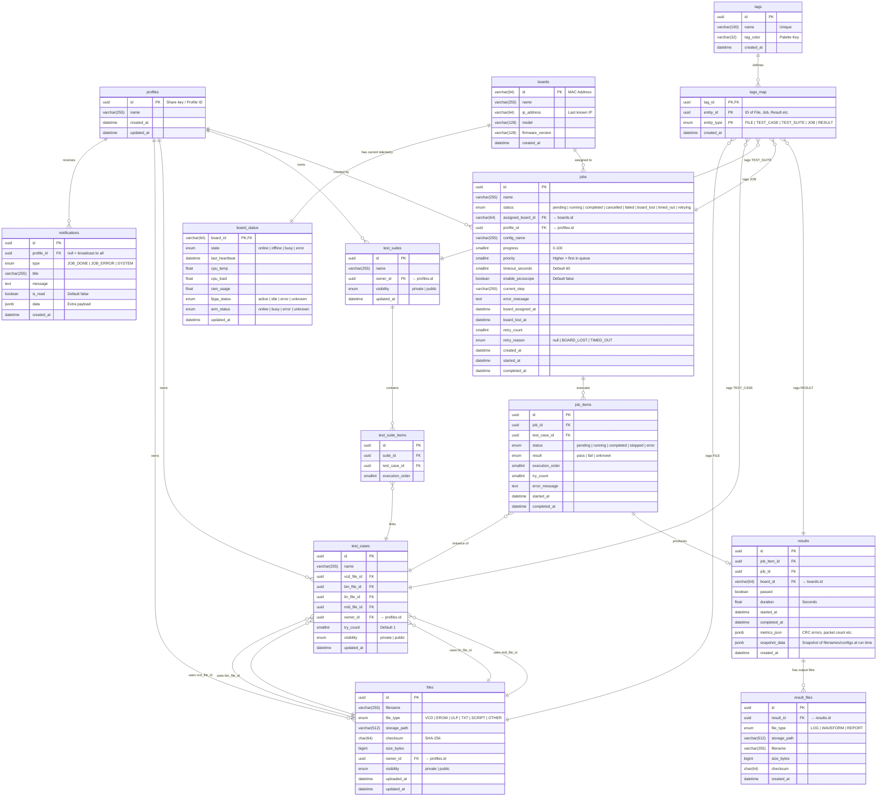

# แผนปรับปรุงสถาปัตยกรรมฐานข้อมูล (Proposed Database Redesign - Enterprise Grade)
**สถานะ:** ข้อเสนอฉบับสมบูรณ์ | **วันที่อัปเดต:** 13 พฤษภาคม 2026

เอกสารฉบับนี้เป็น **Source of Truth** สำหรับการออกแบบฐานข้อมูลใหม่ มุ่งเน้นไปที่ความถูกต้องของข้อมูล (Data Integrity), การรองรับข้อผิดพลาดระดับฮาร์ดแวร์ (Fault Tolerance), และการแยกส่วนประกอบที่ชัดเจน (Separation of Concerns)

> **⚠️ Naming Convention:** 
> ฐานข้อมูลทั้งหมดจะใช้มาตรฐาน **`snake_case`** (เช่น `vcd_file_id`, `created_at`) 
> ส่วนการแปลงเป็น `camelCase` (เช่น `vcdFileId`) เพื่อคุยกับ Frontend จะเป็นหน้าที่ของ Pydantic Models ใน API Layer เพื่อไม่ให้เกิดการปะปนของ Naming Convention ในระดับ Schema

---

## 1. แผนผังความสัมพันธ์ (Complete ER Diagram)

---

## 2. นิยาม Ownership และ Visibility (Access Control)
ตารางหลักทั้งหมด (`files`, `test_cases`, `test_suites`) จะต้องระบุ `owner_id` (อ้างอิง `profiles.id`) และมีกฎการมองเห็นดังนี้:
*   **`public`**: Profiles ทุกคนสามารถค้นเจอ, ดูรายละเอียด, และนำไปใช้รันได้ (Read-Only)
*   **`private`**: เฉพาะ `owner_id` ที่สร้างเท่านั้นถึงจะเห็นและใช้งานได้

*(หมายเหตุ: Profiles Data จะทำหน้าที่เก็บแค่ Preferences หรือ Config ของ User ไม่ใช่แหล่งเก็บ Test Case หลักอีกต่อไป)*

---

## 3. Execution Model และ Snapshot Data
โครงสร้างใหม่ยกเลิกการใช้ `job_files` และ `pairs_data` (Frontend Cache) และเปลี่ยนมาใช้โครงสร้างที่แข็งแรง:
*   **`jobs`**: คำสั่งรันระดับบนสุด (Batch/Run Request)
*   **`job_items`**: ตัวแทนของแต่ละ Test Case ที่อยู่ใน Job นั้น
*   **`results`**: ผลลัพธ์จากการรันของ Job Item นั้นๆ
*   **`result_files`**: ไฟล์ Output (Log/Waveform) ที่แยกออกมา ไม่เก็บรวมใน Database

**Snapshot Data ใน `results`:**
เพื่อให้ผลลัพธ์ย้อนหลังมีความถูกต้องแม้ File หรือ Profile จะถูกแก้ไขในภายหลัง จะมีการเก็บ Snapshot ลง `snapshot_data` (JSONB) เสมอ เช่น:
*   ชื่อไฟล์ตอนรัน (`vcd_filename`, `bin_filename`)
*   Checksum ของไฟล์ตอนรัน
*   ชื่อ Board ตอนรัน
*   ชื่อ Profile Display Name ตอนรัน
*   Config Options และ Try Count

---

## 4. ระบบ Fault Tolerance (Hardware Reliability)
เพิ่มโครงสร้างรองรับความไม่เสถียรของ Hardware (Board Loss) ในตาราง `jobs`:
*   **Status**: เพิ่ม `board_lost`, `timed_out`, `retrying`
*   **Audit Logging**: `board_assigned_at`, `board_lost_at`, `last_board_heartbeat` เพื่อให้รู้จังหวะเวลาที่หายไป
*   **Retry Logic**: `retry_count`, `retry_reason` เพื่อแยกว่า Retry เพราะบอร์ดหลุด หรือสาเหตุอื่น

---

## 5. Indexes และ Constraints (Performance & Data Integrity)
เพื่อรองรับระบบระดับ Production ต้องมีการทำ Database Indexes และ Constraints ดังนี้:

**Indexes:**
*   `jobs(status, priority, created_at)` - สำหรับให้ Queue Engine ดึงงานไปรันได้อย่างรวดเร็ว
*   `job_items(job_id, execution_order)` - ดึงคิวงานย่อยได้อย่างถูกต้อง
*   `results(job_id)` และ `results(job_item_id)` - เพื่อสรุปผล Job
*   `files(checksum)` - ตรวจสอบไฟล์ซ้ำซ้อน
*   `board_status(last_heartbeat)` - ให้ Watchdog ค้นหา Board ที่หายไปได้เร็ว

**Constraints:**
*   `tags(name)` - ต้องเป็น UNIQUE
*   `tags_map(tag_id, entity_type, entity_id)` - ต้องเป็น UNIQUE (ห้ามติดแท็กซ้ำให้ของชิ้นเดิม)

**⚠️ ข้อควรระวังเรื่อง Polymorphic Tags (`tags_map`):**
เนื่องจาก `entity_type` + `entity_id` ไม่สามารถทำ Foreign Key Constraint ผูกมัดข้ามหลายตารางได้ในฐานข้อมูลเชิงสัมพันธ์ทั่วไป (RDBMS) ระบบ **Application Layer (Services)** จะต้องมี Validation และ Cleanup Strategy เสมอ เช่น เมื่อสั่งลบ `files` ฝั่ง Service ต้องสั่งลบ `tags_map` ที่มี `entity_type='FILE'` และ `entity_id=file.id` ด้วย

---

## 6. Migration Plan (กลยุทธ์การอัปเดตแบบ Zero-Downtime)
กระบวนการย้ายจากโครงสร้างเก่า (`eval_system_demo.db`) สู่โครงสร้างใหม่:

*   **Phase 1: Schema Setup** - สร้างตารางใหม่ทั้งหมด และเพิ่มคอลัมน์ที่ขาดในตารางเดิม
*   **Phase 2: Dual-write** - แก้ API ให้ตอนบันทึกข้อมูล จะเขียนลงทั้งตารางเก่า (เช่น `job_files`, `pairs_data`) และตารางใหม่ (เช่น `job_items`)
*   **Phase 3: Backfill** - รัน Script ทยอยดึงข้อมูลจากตารางเก่า/Profiles JSON มา Map ลงตารางใหม่ให้ครบ 100%
*   **Phase 4: Switch Reads** - เปลี่ยน API ให้เริ่มอ่าน (Query) ข้อมูลจากตารางใหม่ทั้งหมด
*   **Phase 5: Cleanup** - ลบตารางและคอลัมน์ตกค้าง (Legacy Fields) ทิ้งไป

---

## 7. Compatibility Mapping (สำหรับ Backfill Data)
ตารางสรุปการจับคู่ข้อมูลเก่าเข้าสู่ Schema ใหม่:

| โครงสร้างเก่า (Legacy) | โครงสร้างใหม่ (Normalized Schema) |
| :--- | :--- |
| `job_files` | `job_items` |
| `jobs.pairs_data` | แปลงเป็น `job_items` หลายๆ Row |
| `library_tags`, `file_tags`, `jobs.tag` | `tags` และ `tags_map` |
| `results.waveform_hdf5_path`, `results.console_log` | `result_files` |
| `profiles.data.savedTestCases` (JSON Blob) | `test_cases` |
| `profiles.data.savedTestCaseSets` (JSON Blob)| `test_suites` และ `test_suite_items` |

---

## 8. พจนานุกรมข้อมูล (Data Dictionary)

ในหัวข้อนี้จะแจกแจงรายละเอียดของทุกตารางและทุกฟิลด์ในรูปแบบตารางเพื่อใช้เป็นมาตรฐานในการพัฒนา

### 8.1 กลุ่มตาราง Identity (บัญชีและการแจ้งเตือน)

#### ตาราง: `profiles`
**วัตถุประสงค์:** เก็บข้อมูลตัวตนและ Preferences เบื้องต้นของผู้ใช้งานแทนการพึ่งพา LocalStorage เพียงอย่างเดียว

| ฟิลด์ (Field) | ประเภท (Type) | คำอธิบายวัตถุประสงค์ |
| :--- | :--- | :--- |
| `id` | uuid (PK) | Share Key / รหัสอ้างอิงหลักของ Profile |
| `name` | varchar(255) | ชื่อที่ผู้ใช้ตั้งสำหรับแสดงผล |
| `created_at` | datetime | วันที่เริ่มสร้าง Profile |
| `updated_at` | datetime | วันที่แก้ไขล่าสุด |

#### ตาราง: `notifications`
**วัตถุประสงค์:** ระบบแจ้งเตือนเหตุการณ์สำคัญภายในแอปพลิเคชัน

| ฟิลด์ (Field) | ประเภท (Type) | คำอธิบายวัตถุประสงค์ |
| :--- | :--- | :--- |
| `id` | uuid (PK) | รหัสอ้างอิงการแจ้งเตือน |
| `profile_id` | uuid (FK → **profiles.id**) | อ้างอิง Profile (ถ้า NULL คือแจ้งเตือนทุกคน) |
| `type` | enum | ประเภท: JOB_DONE, JOB_ERROR, SYSTEM |
| `title` | varchar(255) | หัวข้อการแจ้งเตือน |
| `message` | text | รายละเอียดเนื้อหา |
| `is_read` | boolean | สถานะการอ่าน (true/false) |
| `data` | jsonb | ข้อมูลเพิ่มเติมสำหรับ Frontend (เช่น jobId) |
| `created_at` | datetime | เวลาที่ส่งการแจ้งเตือน |

---

### 8.2 กลุ่มตาราง Hardware (การจัดการอุปกรณ์)

#### ตาราง: `boards`
**วัตถุประสงค์:** ทะเบียนข้อมูลถาวรของอุปกรณ์ Zybo Agent

| ฟิลด์ (Field) | ประเภท (Type) | คำอธิบายวัตถุประสงค์ |
| :--- | :--- | :--- |
| `id` | varchar(64) PK | MAC Address ของบอร์ด (ใช้เป็นรหัสอ้างอิงหลัก) |
| `name` | varchar(255) | ชื่อเล่นของบอร์ดเพื่อให้อ่านง่าย |
| `ip_address` | varchar(64) | IP ล่าสุดที่ได้รับจากการทำ Heartbeat |
| `model` | varchar(128) | รุ่นของฮาร์ดแวร์ |
| `firmware_version`| varchar(128) | เวอร์ชันของ Agent Firmware |
| `created_at` | datetime | วันที่บอร์ดถูกลงทะเบียนเข้าระบบ |

#### ตาราง: `board_status`
**วัตถุประสงค์:** เก็บสถานะพลวัต (Dynamic) ของบอร์ดที่เปลี่ยนแปลงตลอดเวลา

| ฟิลด์ (Field) | ประเภท (Type) | คำอธิบายวัตถุประสงค์ |
| :--- | :--- | :--- |
| `board_id` | varchar(64) (FK → **boards.id**) | อ้างอิงบอร์ด (Primary Key ร่วม) |
| `state` | enum | online, offline, busy, error |
| `last_heartbeat` | datetime | เวลาล่าสุดที่ติดต่อเข้ามา (Watchdog) |
| `cpu_temp` | float | อุณหภูมิ CPU |
| `cpu_load` | float | ภาระงาน CPU (%) |
| `ram_usage` | float | การใช้หน่วยความจำ (%) |
| `fpga_status` | enum | active, idle, error, unknown |
| `arm_status` | enum | online, busy, error, unknown |
| `updated_at` | datetime | เวลาที่อัปเดตข้อมูลล่าสุด |

---

### 8.3 กลุ่มตาราง Assets (ไฟล์และแท็ก)

#### ตาราง: `files`
**วัตถุประสงค์:** ทะเบียนไฟล์ Library ทั้งหมดที่อัปโหลดโดย User

| ฟิลด์ (Field) | ประเภท (Type) | คำอธิบายวัตถุประสงค์ |
| :--- | :--- | :--- |
| `id` | uuid (PK) | รหัสอ้างอิงไฟล์ |
| `filename` | varchar(255) | ชื่อไฟล์ดั้งเดิม |
| `file_type` | enum | VCD, EROM, ULP, TXT, SCRIPT, OTHER |
| `storage_path` | varchar(512) | ตำแหน่งที่เก็บไฟล์จริงบน Server |
| `checksum` | char(64) | SHA-256 ป้องกันไฟล์ซ้ำและตรวจสอบความสมบูรณ์ |
| `size_bytes` | bigint | ขนาดไฟล์ (Bytes) |
| `owner_id` | uuid (FK → **profiles.id**) | Profile ID ผู้ที่อัปโหลด |
| `visibility` | enum | private, public |
| `uploaded_at` | datetime | วันที่อัปโหลด |
| `updated_at` | datetime | วันที่แก้ไขข้อมูลล่าสุด |

#### ตาราง: `tags`
**วัตถุประสงค์:** มาสเตอร์ข้อมูลแท็กที่ใช้ร่วมกันทั้งระบบ

| ฟิลด์ (Field) | ประเภท (Type) | คำอธิบายวัตถุประสงค์ |
| :--- | :--- | :--- |
| `id` | uuid (PK) | รหัสอ้างอิงแท็ก |
| `name` | varchar(100) | ชื่อแท็ก (UNIQUE) |
| `tag_color` | varchar(32) | รหัสสี (Palette Key) |
| `created_at` | datetime | วันที่สร้างแท็ก |

#### ตาราง: `tags_map`
**วัตถุประสงค์:** ตัวเชื่อมความสัมพันธ์แบบ Many-to-Many ระหว่างแท็กกับสิ่งต่างๆ

| ฟิลด์ (Field) | ประเภท (Type) | คำอธิบายวัตถุประสงค์ |
| :--- | :--- | :--- |
| `tag_id` | uuid (FK → **tags.id**) | อ้างอิงแท็ก |
| `entity_id` | uuid | รหัสอ้างอิง (ID) ของข้อมูลเป้าหมายที่เราต้องการนำแท็กไปแปะ |
| `entity_type` | enum | ระบุชื่อตารางเป้าหมาย (เช่น 'FILE', 'JOB', 'TEST_CASE', 'TEST_SUITE') การใช้ `type` คู่กับ `id` เรียกว่าโครงสร้าง Polymorphic ช่วยให้ใช้ตาราง `tags_map` นี้เชื่อมแท็กได้กับทุกๆ ระบบย่อย โดยไม่ต้องสร้างตาราง map แยก (เช่น ไม่ต้องสร้าง `file_tags`, `job_tags` แยกกันให้ซ้ำซ้อน) |
| `created_at` | datetime | วันที่ติดแท็กให้สิ่งนี้ |

---

### 8.4 กลุ่มตาราง Test Logic (นิยามการทดสอบ)

#### ตาราง: `test_cases`
**วัตถุประสงค์:** นิยามการทดสอบหนึ่งรายการที่ประกอบด้วยไฟล์หลายประเภท

| ฟิลด์ (Field) | ประเภท (Type) | คำอธิบายวัตถุประสงค์ |
| :--- | :--- | :--- |
| `id` | uuid (PK) | รหัสอ้างอิง Test Case |
| `name` | varchar(255) | ชื่อเรียกการทดสอบ |
| `vcd_file_id` | uuid (FK → **files.id**) | อ้างอิงไฟล์ VCD |
| `bin_file_id` | uuid (FK → **files.id**) | อ้างอิงไฟล์ Firmware (EROM) |
| `lin_file_id` | uuid (FK → **files.id**) | อ้างอิงไฟล์ Logic (ULP) |
| `mdi_file_id` | uuid (FK → **files.id**) | อ้างอิงไฟล์คำสั่ง (TXT) |
| `owner_id` | uuid (FK → **profiles.id**) | Profile ID ผู้สร้าง |
| `try_count` | smallint | จำนวนรอบที่ต้องรันต่อครั้ง |
| `visibility` | enum | private, public |
| `updated_at` | datetime | วันที่แก้ไขข้อมูลล่าสุด |

#### ตาราง: `test_suites`
**วัตถุประสงค์:** กลุ่มของ Test Cases (Test Suite)

| ฟิลด์ (Field) | ประเภท (Type) | คำอธิบายวัตถุประสงค์ |
| :--- | :--- | :--- |
| `id` | uuid (PK) | รหัสอ้างอิง Test Suite |
| `name` | varchar(255) | ชื่อเรียก Test Suite |
| `owner_id` | uuid (FK → **profiles.id**) | Profile ID ผู้สร้าง |
| `visibility` | enum | private, public |
| `updated_at` | datetime | วันที่แก้ไขข้อมูลล่าสุด |

#### ตาราง: `test_suite_items`
**วัตถุประสงค์:** จัดการลำดับความสัมพันธ์ภายใน Test Suite

| ฟิลด์ (Field) | ประเภท (Type) | คำอธิบายวัตถุประสงค์ |
| :--- | :--- | :--- |
| `id` | uuid (PK) | รหัสอ้างอิงรายการในเซต |
| `suite_id` | uuid (FK → **test_suites.id**) | อ้างอิง Test Suite หลัก |
| `test_case_id` | uuid (FK → **test_cases.id**) | อ้างอิง Test Case ที่อยู่ในเซต |
| `execution_order` | smallint | ลำดับการรันงาน |

---

### 8.5 กลุ่มตาราง Execution & Results (การทำงานและผลลัพธ์)

#### ตาราง: `jobs`
**วัตถุประสงค์:** คุมการทำงานของชุดงานรัน (Batch Request)

| ฟิลด์ (Field) | ประเภท (Type) | คำอธิบายวัตถุประสงค์ |
| :--- | :--- | :--- |
| `id` | uuid (PK) | รหัสอ้างอิง Job |
| `name` | varchar(255) | ชื่อเรียก Job |
| `status` | enum | pending, running, completed, cancelled, failed, board_lost, timed_out, retrying |
| `assigned_board_id`| varchar(64) (FK → **boards.id**) | บอร์ดที่ได้รับมอบหมายงานนี้ |
| `profile_id` | uuid (FK → **profiles.id**) | Profile ID ผู้สั่งรัน |
| `config_name` | varchar(255) | ชื่อ Configuration ที่ใช้รัน |
| `progress` | smallint | ความคืบหน้ารวม (%) |
| `priority` | smallint | ลำดับความสำคัญในคิว |
| `timeout_seconds` | smallint | เวลาสูงสุดที่ยอมให้รันงานนี้ |
| `enable_picoscope` | boolean | บันทึกสัญญาณด้วย Picoscope หรือไม่ |
| `current_step` | varchar(255) | ขั้นตอนปัจจุบัน (Human-readable) |
| `error_message` | text | ข้อความแสดงความผิดพลาดระดับ Job |
| `board_assigned_at`| datetime | เวลาที่เริ่มส่งงานให้บอร์ด |
| `board_lost_at` | datetime | เวลาที่บอร์ดหายไปจากระบบระหว่างรัน |
| `retry_count` | smallint | จำนวนครั้งที่ Retry เพราะบอร์ดหาย |
| `retry_reason` | enum | null, BOARD_LOST, TIMED_OUT |
| `created_at` | datetime | เวลาที่สร้าง Job |
| `started_at` | datetime | เวลาที่เริ่มรันจริง |
| `completed_at` | datetime | เวลาที่จบงาน (เสร็จสิ้นหรือผิดพลาด) |

#### ตาราง: `job_items`
**วัตถุประสงค์:** รายการเนื้องานย่อย (Test Instance) ภายในหนึ่ง Job

| ฟิลด์ (Field) | ประเภท (Type) | คำอธิบายวัตถุประสงค์ |
| :--- | :--- | :--- |
| `id` | uuid (PK) | รหัสอ้างอิง Job Item |
| `job_id` | uuid (FK → **jobs.id**) | อ้างอิง Job หลัก |
| `test_case_id` | uuid (FK → **test_cases.id**) | อ้างอิง Test Case ต้นแบบ |
| `status` | enum | pending, running, completed, stopped, error |
| `result` | enum | pass, fail, unknown |
| `execution_order` | smallint | ลำดับการรัน |
| `try_count` | smallint | จำนวนรอบที่รันจริง |
| `error_message` | text | ข้อความแสดงความผิดพลาดระดับไฟล์ |
| `started_at` | datetime | เวลาเริ่มรันไฟล์นี้ |
| `completed_at` | datetime | เวลาจบการรันไฟล์นี้ |

#### ตาราง: `results`
**วัตถุประสงค์:** รายละเอียดและเมตริกผลการทดสอบ

| ฟิลด์ (Field) | ประเภท (Type) | คำอธิบายวัตถุประสงค์ |
| :--- | :--- | :--- |
| `id` | uuid (PK) | รหัสอ้างอิงผลลัพธ์ |
| `job_item_id` | uuid (FK → **job_items.id**) | อ้างอิงรายการงานย่อย |
| `job_id` | uuid (FK → **jobs.id**) | อ้างอิง Job หลัก |
| `board_id` | varchar(64) (FK → **boards.id**) | บอร์ดที่ทำการทดสอบ |
| `passed` | boolean | ผลลัพธ์รวม (True/False) |
| `duration` | float | เวลาที่ใช้รัน (วินาที) |
| `metrics_json` | jsonb | ข้อมูลเชิงตัวเลข (CRC, Packet Count ฯลฯ) |
| `snapshot_data` | jsonb | **สำคัญ:** สำเนาชื่อไฟล์/สเปก ณ วันที่รัน |
| `created_at` | datetime | วันที่บันทึกผล |

#### ตาราง: `result_files`
**วัตถุประสงค์:** เก็บ Path และ Metadata ของไฟล์ Output ขนาดใหญ่

| ฟิลด์ (Field) | ประเภท (Type) | คำอธิบายวัตถุประสงค์ |
| :--- | :--- | :--- |
| `id` | uuid (PK) | รหัสอ้างอิงไฟล์ผลลัพธ์ |
| `result_id` | uuid (FK → **results.id**) | อ้างอิงผลลัพธ์หลัก |
| `file_type` | enum | LOG, WAVEFORM, REPORT |
| `storage_path` | varchar(512) | ที่อยู่ไฟล์จริงบน Server |
| `filename` | varchar(255) | ชื่อไฟล์สำหรับแสดงผลตอน Download |
| `size_bytes` | bigint | ขนาดไฟล์ |
| `checksum` | char(64) | SHA-256 สำหรับตรวจสอบไฟล์ |
| `created_at` | datetime | วันที่สร้างไฟล์ |
