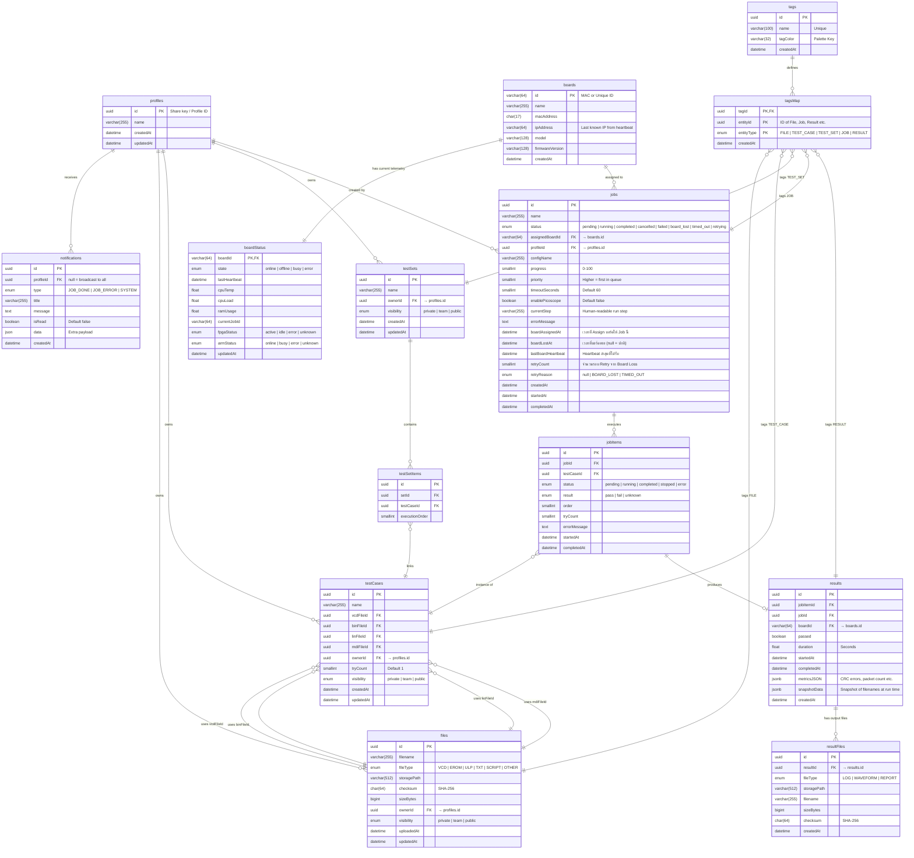

# แผนปรับปรุงสถาปัตยกรรมฐานข้อมูล (Proposed Database Redesign)
**สถานะ:** ร่างข้อเสนอ (แก้ไข Critical & Important) | **วันที่อัปเดต:** 12 พฤษภาคม 2026

---

## 1. แผนผังความสัมพันธ์ (Complete ER Diagram)

---

## 2. การแก้ไขที่ดำเนินการ (Applied Fixes)

### 🔴 Critical
| ปัญหา | การแก้ไข |
| :--- | :--- |
| ขาดตาราง `profiles` | เพิ่มตาราง `profiles` และทำ FK จากทุกตารางที่มี `ownerId` |
| ขาดตาราง `notifications` | เพิ่มตาราง `notifications` พร้อม `profileId` FK |
| `boards` ขาด `ipAddress` | เพิ่มคอลัมน์ `ipAddress varchar(64)` เพื่อเก็บ IP ล่าสุดจาก Heartbeat |

### 🟡 Important
| ปัญหา | การแก้ไข |
| :--- | :--- |
| `jobItems` ขาด Timestamps | เพิ่ม `startedAt`, `completedAt`, `errorMessage` |
| `jobs` เก็บฟิลด์สำคัญใน JSON blob | ย้าย `priority`, `timeoutSeconds`, `enablePicoscope`, `currentStep`, `errorMessage`, `profileId`, `configName` ออกเป็นคอลัมน์จริง |
| `results` ขาด Timing | เพิ่ม `startedAt` และ `completedAt` |
| `boardStatus` ขาด FPGA/ARM | เพิ่ม `fpgaStatus` และ `armStatus` เป็น ENUM |

### 🛡️ Fault Tolerance (Board Loss)
| ปัญหา | การแก้ไข |
| :--- | :--- |
| Job ค้างเมื่อบอร์ดหาย | เพิ่ม `status = board_lost` และ `timed_out` ใน Job ENUM |
| ไม่รู้ว่าบอร์ดหายเมื่อไหร่ | เพิ่ม `boardLostAt` และ `lastBoardHeartbeat` ใน `jobs` |
| ไม่รู้ว่า Retry เพราะอะไร | เพิ่ม `retryCount` + `retryReason (BOARD_LOST\|TIMED_OUT)` ใน `jobs` |
| ไม่รู้เวลาที่ Assign บอร์ด | เพิ่ม `boardAssignedAt` ใน `jobs` (Audit Trail แบบ Lightweight) |

---

## 3. สรุปตารางทั้งหมด (14 Tables)

| # | Table | กลุ่ม | หน้าที่ |
| :-- | :--- | :--- | :--- |
| 1 | `profiles` | Identity | ทะเบียนผู้ใช้งาน (No-login Profile) |
| 2 | `notifications` | Identity | การแจ้งเตือนของระบบ |
| 3 | `boards` | Hardware | ทะเบียนบอร์ด Zybo (Static + IP) |
| 4 | `boardStatus` | Hardware | สถานะ Real-time + FPGA/ARM |
| 5 | `files` | Library | ไฟล์ที่ User Upload |
| 6 | `tags` | Tagging | มาสเตอร์ Tag (Unified) |
| 7 | `tagsMap` | Tagging | Polymorphic Tag Mapping |
| 8 | `testCases` | Test Logic | นิยามชุดไฟล์ทดสอบ |
| 9 | `testSets` | Test Logic | กลุ่ม Test Suite |
| 10 | `testSetItems` | Test Logic | ลำดับ Test Case ใน Set |
| 11 | `jobs` | Execution | คุมการรัน (พร้อม Priority/Timeout) |
| 12 | `jobItems` | Execution | เนื้องานย่อย (พร้อม Timestamps) |
| 13 | `results` | Results | ผลลัพธ์ (พร้อม startedAt/completedAt) |
| 14 | `resultFiles` | Results | ไฟล์ผลลัพธ์ (Log/Waveform/Report) |

---

[🔙 กลับไปยังแผนผังหลัก](./FE_MENU_API_DB_MAPPING.md)
