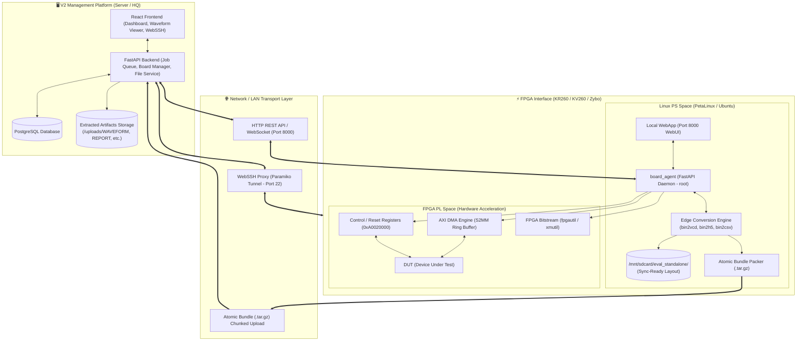
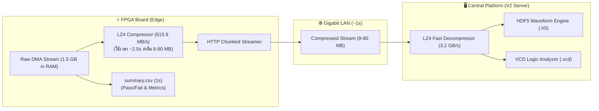

# สถาปัตยกรรมระบบทดสอบฮาร์ดแวร์แบบสมบูรณ์ (V2 Platform & FPGA Interface Architecture)

**วันที่จัดทำ:** 26 สิงหาคม 2026  
**สถานะ:** เอกสารทางการ (Official System Specification)  
**ขอบเขต:** V2 Central Platform (Server/HQ) ⟷ FPGA Interface (KR260/KV260/Zybo Board Agent & Standalone)

---

## 1. ภาพรวมสถาปัตยกรรมระบบ (System Architecture Overview)

ระบบถูกออกแบบให้ทำงานได้ **2 โหมดหลัก**:
1. **V2 Connected Mode (Centralized Control):** สั่งงานผ่าน Web UI กลาง, บริหารจัดการคิวงาน (Job Queue), แจกจ่ายงานไปยังบอร์ด FPGA หลายตัวพร้อมกัน, จัดเก็บ Waveform และแสดงผลกราฟ
2. **Standalone Mode (Autonomous Edge Execution):** บอร์ด FPGA สามารถรันงานทดสอบ บันทึกสัญญาณ และแปลงผลลัพธ์ได้ด้วยตัวเอง โดยสั่งงานผ่าน **Local WebApp บนบอร์ด (KV/KR Board WebUI)**, **cURL API ผ่าน LAN**, หรือ **Local CLI** พร้อมบันทึกผลลง SD Card และพร้อมรองรับการ Sync ย้อนหลัง

---

## 2. โครงสร้างการส่งข้อมูลด้วย LZ4 Streaming & Central Conversion Pipeline

---

## 3. วงจรการทำงานของคำสั่งทดสอบ (Test Vector Execution Flow)

1. **Direct Test Vector:** คนทำ Test Case เตรียมไฟล์ Binary Instruction สำเร็จรูป (ไม่ต้องแปลงจาก VCD)
2. **DMA Arming:** ตั้งค่า Scatter-Gather BD Ring บน Physical Memory
3. **Execution & Driving:** ยิงคำสั่งเข้า AXI Register / DMA Stream ไปยัง DUT
4. **Capture:** ดึงข้อมูลผ่าน S2MM Ring เข้าสู่ไฟล์ `.bin`
5. **Local Multi-Conversion:** แปลงเป็น `.vcd`, `.h5`, `.csv` ทันทีบนบอร์ด
6. **Delivery:**
   - **ถ้าต่อ V2:** ส่ง Atomic Bundle `.tar.gz` ผ่าน Chunked Uploader
   - **ถ้าเป็น Standalone:** บันทึกเก็บลง `/mnt/sdcard/eval_standalone/pending_sync/`

---

## 4. กลยุทธ์การกู้คืนข้อผิดพลาดระดับฮาร์ดแวร์ (Fault Recovery Strategy)

ระบบใช้แนวทาง **Force Board Reboot** ร่วมกับ Watchdog Sweeper:

| ลำดับ | เหตุการณ์ | การทำงานของระบบ |
| :---: | :--- | :--- |
| **1** | DMA Timeout / Bus Hang / DUT ไม่ตอบสนอง | Agent ส่งสถานะ `ERROR` หรือ Backend ตรวจพบ Timeout (> 60s) |
| **2** | Force Board Reboot Trigger | Backend ส่งคำสั่ง `POST /system/reboot` ไปยังบอร์ดทันที |
| **3** | Immediate State Lock | Backend ปรับสถานะบอร์ดในฐานข้อมูลเป็น `offline` และล็อก Cooldown 35-45s |
| **4** | Clean Restart & Rediscovery | บอร์ด PetaLinux บูตเสร็จ ยิง Heartbeat `POST /api/agent/register` กลับมา ระบบนำบอร์ดเข้าพร้อมรับคิวงานใหม่ 100% |
