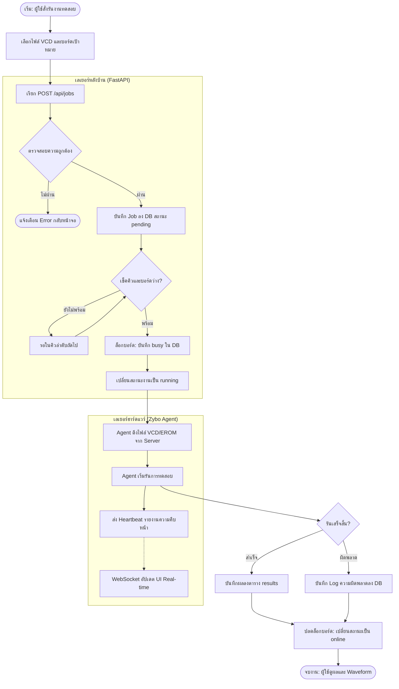

# 🌊 แผนภาพลำดับการทำงานของระบบ (System Flow Diagram)
**วันที่สกัดข้อมูล:** 11 พฤษภาคม 2026
**แหล่งข้อมูล:** วิเคราะห์ตรรกะจาก `services/job_queue.py` และ `services/board_manager.py`

เอกสารนี้แสดงขั้นตอนการไหลของข้อมูลและการตัดสินใจ (Logic Flow) ตั้งแต่เริ่มต้นจนสิ้นสุดกระบวนการทดสอบ

---

## 1. ผังกระบวนการทำงานหลัก (Main Workflow Flowchart)

---

## 2. รายละเอียดขั้นตอนทางเทคนิค (Technical Steps)

### ก. การรับเข้าข้อมูล (Input & Validation)
- ระบบตรวจสอบ `vcd_file_id` ว่ามีไฟล์จริงอยู่ในคลังหรือไม่
- ตรวจสอบ `target_board_id` ว่าบอร์ดออนไลน์อยู่หรือไม่ก่อนรับงานเข้าคิว

### ข. การจัดการคิว (Queue Management)
- งานที่รับเข้ามาจะอยู่ในสถานะ `pending` เสมอ
- `JobQueueService` จะวนลูปเช็คงานที่เก่าที่สุด (FIFO) และบอร์ดที่เหมาะสมเพื่อเริ่มงาน

### ค. การล็อกทรัพยากร (Resource Locking)
- **สำคัญมาก:** ระบบจะทำการ Update ตาราง `boards` ให้เป็น `busy` และผูก `current_job_id` ไว้ทันที เพื่อป้องกันไม่ให้งานอื่นเข้ามาแทรกในระหว่างประมวลผล

### ง. การสื่อสารแบบ Real-time (WebSocket Updates)
- ในขณะที่ Agent รันงาน จะมีการส่ง Progress (0-100%) กลับมา
- ข้อมูลนี้จะถูกส่งต่อไปยังผู้ใช้ทุกคนผ่าน WebSocket Topic: `JOB_PROGRESS`

### จ. การสรุปผลและคืนทรัพยากร (Finalization)
- เมื่อได้รับสัญญาณจาก Agent ว่า "Done" ระบบจะรีบทำการ `Unlock` บอร์ดใน Database ทันทีเพื่อให้คิวถัดไปเริ่มทำงานได้โดยไม่มี Delay

---
> **คำแนะนำ:** เอกสารนี้สามารถใช้ร่วมกับ `DATABASE_SCHEMA_FULL.md` เพื่อแสดงให้เห็นว่าข้อมูลถูกแก้ไขในตารางไหน ณ ขั้นตอนใดของ Flow นี้ครับ
