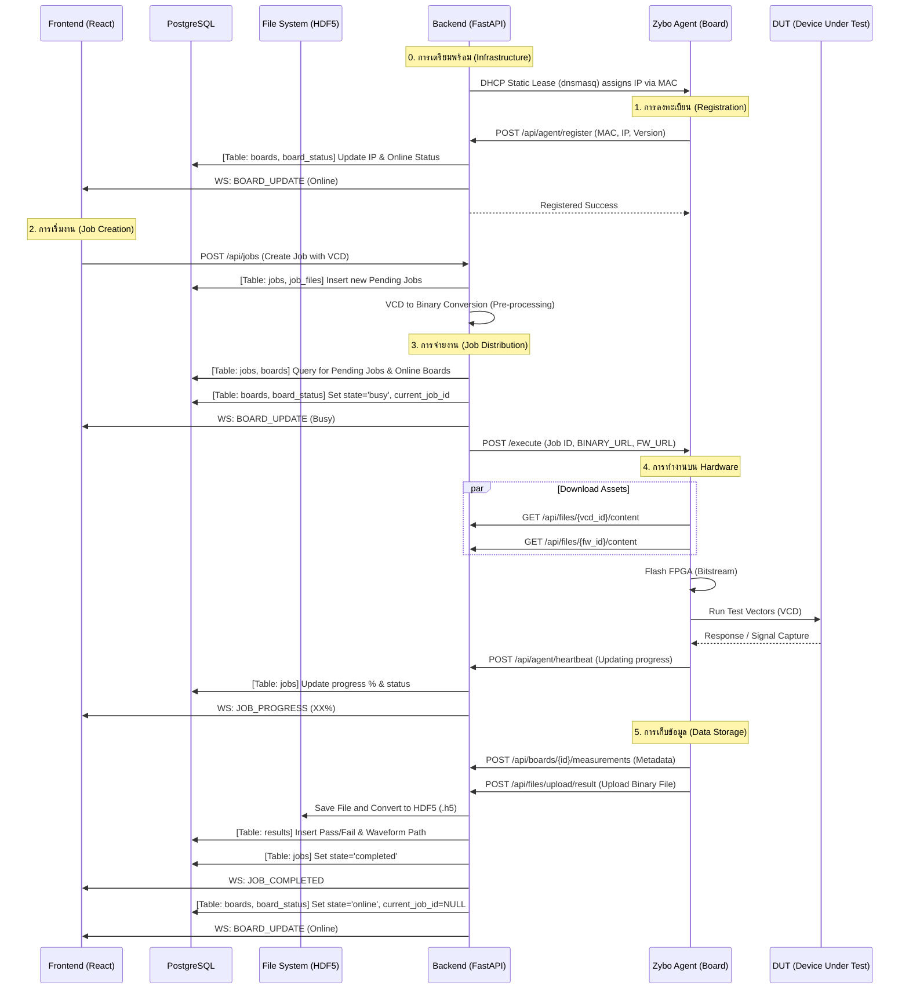

# 📄 เอกสาร Workflow ระบบ Hardware Layer (Eval System V2)

เอกสารฉบับนี้อธิบายกระบวนการทำงานระหว่าง **Backend** และ **Zybo Agent (Hardware)** รวมถึงการดึงข้อมูลและจัดเก็บข้อมูลลงในฐานข้อมูล (Database)

## 1. แผนผังการทำงาน (System Workflow Diagram)


<br/>



---

## 2. การลงทะเบียนของ Zybo (Board Registration)

เมื่อบอร์ด Zybo บูตระบบขึ้นมา (Boot-up) Agent จะทำการ "Phone Home" มาที่ Backend เพื่อรายงานตัว

*   **API Endpoint:** `POST /api/agent/register`
*   **การจัดการ IP (IP Assignment):** บอร์ด Zybo ไม่ต้องกำหนด IP เอง แต่ระบบจะใช้ **Static DHCP Lease** โดยตัว Server (Gateway) จะรันบริการ `dnsmasq` เพื่อจ่าย IP ให้กับบอร์ดตาม MAC Address ที่ระบุไว้ในคอนฟิก (ทำให้บอร์ดได้ IP เดิมเสมอ)
*   **กระบวนการ:** เมื่อบอร์ดได้รับ IP แล้ว Agent จะทำการส่งข้อมูล MAC และ IP มาที่ Backend เพื่อยืนยันตัวตน
*   **ตารางที่เกี่ยวข้อง (Tables):**
    1.  **`boards`**: เก็บข้อมูลพื้นฐาน เช่น `id`, `name`, `mac_address`, `ip_address`, `model`, `firmware_version`
    2.  **`board_status`**: เก็บสถานะปัจจุบัน เช่น `state` (online/busy/error), `last_heartbeat`, `cpu_temp`, `cpu_load`

---

## 3. การจ่ายงานและการจัดการ Workflow (Job Distribution)

Backend จะมี **JobQueueService** ทำหน้าที่เป็นผู้แจกจ่ายงานให้กับบอร์ดที่ว่างอยู่

*   **ตารางที่ใช้ดึงงาน (Queue Source):**
    *   **`jobs`**: เก็บรายการงานที่รอรัน (`state = 'pending'`) โดยเรียงตาม `priority` และ `queue_position`
    *   **`job_files`**: เก็บรายการไฟล์ทดสอบ (VCD, Firmware) ภายในงานนั้นๆ
*   **การเลือกบอร์ด (Board Selection):**
    *   ดึงข้อมูลจากตาราง **`boards`** และ **`board_status`** โดยเลือกบอร์ดที่มี `state = 'online'`
*   **การโอนไฟล์ (File Transfer Details):**
    1.  Backend จะสร้าง **Download URL** สำหรับไฟล์ VCD และ Firmware (EROM) โดยชี้มาที่ Endpoint `GET /api/files/{id}/content` ของตัวเอง
    2.  Backend ส่ง URL เหล่านี้ไปใน Payload ของ API `/execute` ที่เรียกไปยัง Agent
    3.  Agent จะเป็นผู้ทำการ **Download** ไฟล์จาก Backend มาเก็บไว้ในเครื่อง (Local Storage/RAM) ก่อนเริ่มทำการ Flash หรือ Run Test
*   **การจ่ายงาน (Dispatch):**
    *   Backend จะส่งข้อมูลไฟล์ (URLs) ไปที่ Agent ผ่าน API `/execute`
    *   **อัปเดตตาราง:** 
        *   `boards.state` เปลี่ยนเป็น `busy`
        *   `board_status.current_job_id` เก็บ ID ของงานที่กำลังทำ

---

## 4. รายละเอียดการโอนไฟล์ (File Transfer Mechanism)

เพื่อให้บอร์ด Zybo สามารถเข้าถึงไฟล์ VCD และ Firmware ได้อย่างรวดเร็วและปลอดภัย ระบบใช้กลไกดังนี้:

1.  **Preparation (เตรียมไฟล์):** เมื่อ User สั่งรันงาน Backend จะตรวจสอบไฟล์ในตาราง `files` และเตรียม Path ให้พร้อม
2.  **Notification (แจ้งเตือน Agent):** Backend เรียก API `/execute` ไปยัง Agent พร้อมแนบ URL สำหรับดาวน์โหลด เช่น:
    ```json
    {
      "vcd_url": "http://192.168.100.1/api/files/vcd-uuid/content",
      "fw_url": "http://192.168.100.1/api/files/fw-uuid/content"
    }
    ```
3.  **Fetch (การดาวน์โหลด):** 
    *   Agent ใช้ HTTP Library (เช่น `requests` ใน Python) ส่งคำขอ **GET** ไปยัง URL ที่ได้รับ
    *   การโอนย้ายข้อมูลทำผ่านระบบ **Private Network (192.168.100.x)** เพื่อหลีกเลี่ยงคอขวดของ Network ภายนอกและความปลอดภัย
4.  **Local Storage (การจัดเก็บชั่วคราว):**
    *   Agent จะบันทึกไฟล์ลงในหน่วยความจำชั่วคราว (เช่น `/tmp/eval/` หรือ RAM Disk) บนบอร์ด Zybo
    *   ไฟล์ Firmware (.bit) จะถูกนำไป Flash ลง FPGA ทันที
    *   ไฟล์ VCD จะถูกโหลดเข้า Buffer เพื่อส่งสัญญาณทดสอบ
5.  **Cleanup:** เมื่อการทดสอบเสร็จสิ้น Agent จะทำการลบไฟล์ชั่วคราวเหล่านี้ออกเพื่อประหยัดพื้นที่บน SD Card

---

## 5. การเก็บข้อมูลทดสอบ (Test Data Storage)

เมื่อการทดสอบเสร็จสิ้น ข้อมูลจะถูกส่งกลับมาเก็บแบบ Hybrid

*   **การเก็บ Metadata (ข้อมูลสรุป):**
    *   **ตาราง `results`**: เก็บข้อมูลสรุป เช่น `passed` (True/False), `duration_seconds`, `started_at`, `completed_at`, `error_message`, `packet_count`
*   **การเก็บ Waveform (ข้อมูลดิบ):**
    *   เมื่อการทดสอบเสร็จสิ้น Agent จะทำการ **อัปโหลดไฟล์ผลลัพธ์ (Result File)** ทั้งไฟล์ไปที่ Backend ผ่าน HTTP POST (Multipart)
    *   Backend จะนำไฟล์ที่ได้รับไปจัดเก็บและแปลงเป็น **HDF5 (.h5)** ในระบบ File System
    *   **ตาราง `results`** จะเก็บ Path ของไฟล์ไว้ในคอลัมน์ `waveform_hdf5_path` เพื่อใช้ดึงข้อมูลมาแสดงผลในภายหลัง

---

## 6. สรุปตารางที่เกี่ยวข้อง (Table Summary)

| ฟีเจอร์ | ชื่อตาราง (Table Name) | ข้อมูลสำคัญที่เก็บ |
| :--- | :--- | :--- |
| **Inventory** | `boards` | MAC, IP, Firmware Version |
| **Status** | `board_status` | Current State, Temp, Load, Current Job |
| **Queue** | `jobs` | Job Name, Priority, State, Start/End Time |
| **Job Items** | `job_files` | VCD Name, Firmware Name, Order |
| **Results** | `results` | Pass/Fail, Metrics, **Waveform HDF5 Path** |
| **Files** | `files` | Storage Path ของต้นฉบับ VCD/Firmware |
